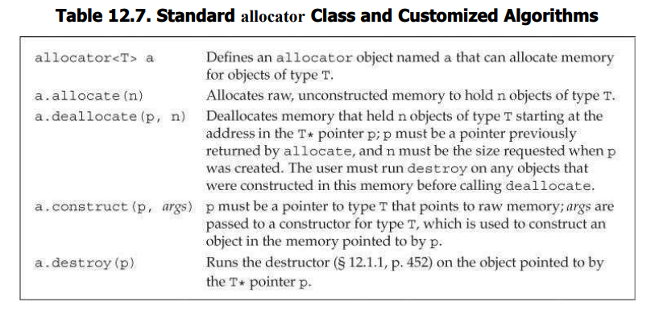
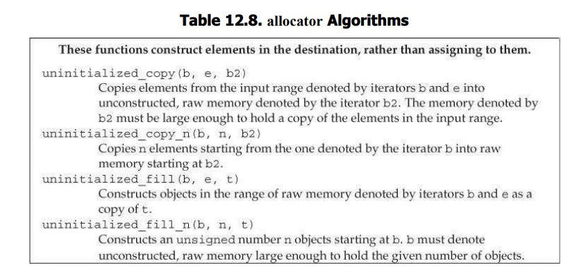

# allocator类

> 将内存分配和对象构造组合在一起，即new，可能会导致不必要的浪费。例如，创建了永远也用不到的对象。



allocator帮助将内存分配和对象构造分离。allocator分配的内存是原始的、未构造的。

allocator根据指定的类型，确定恰当的内存大小和对齐位置。

```cpp
allocator<string> alloc;
auto const p = alloc.allocate(n);
```

# allocator分配未构造的内存

allocator分配的内存是unconstructed，需要在此内存中构造新对象。

第一个参数给定位置，额外参数用来初始化构造的对象。

```cpp
auto q = p; // q指向最后的元素构造之后的位置
alloc.construct(q++);
alloc.construct(q++, 10, 'c');
alloc.construct(q++, "c");
```

> 未构造下，不允许使用原始内存，其行为未定义。

> construct是使用原始内存的必经之路。

使用完，使用destroy销毁对象。

> destroy接受指针，自然想到也是析构。

```cpp
while(q != p) {
	alloc.destroy(--q);
}
```

> 只能对construct的元素destroy。

元素销毁后，可以重新使用该部分内存，或者直接归还。

```cpp
alloc.deallocate(p, n);
```

指针p和数量n都必须和allocate保持一致。

# 拷贝和填充未初始化内存的算法

标准库提供的伴随算法，可以在未初始化内存中创建对象。



举例使用，

```cpp
// allocate twice as many elements as vi holds
auto p = alloc.allocate(vi.size() * 2);
// construct elements starting at p as copies of elements in vi
auto q = uninitialized_copy(vi.begin(), vi.end(), p);
// initialize the remaining elements to 42
uninitialized_fill_n(q, vi.size(), 42);
```

copy的p就代表目标空间；容易知道，p必须指向未构造的内存，且必须足够大。返回（递增后的）目的位置迭代器。fill，在目的位置指针指定位置创建给定数目的对象，并用定值对其进行初始化。

# Practice

重写程序

```cpp
string *const p = new string[n];
string s;
string *q = p;
while(cin >> s && q != p + n) {
	*q++ = s;
}
const size_t size = q - p;
delete[] p;
```

> 这就是所谓的创建了永远也用不到的对象。

使用allocate

```cpp
allocator<string> alloc;
auto const p = alloc.allocate(n);
string s;
string *q = p;
while(q != p + n && cin >> s) {
	alloc.construct(q++, s);
}
while(q != p) {
	cout << *--q << " ";
	alloc.destroy(q);
}
alloc.deallocate(p, n);
```

```
a
b
c
d
e
e d c b a
```

