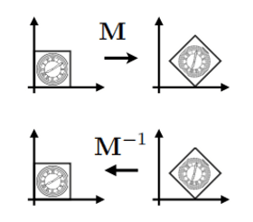
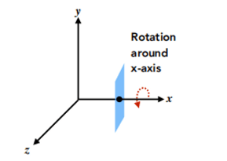
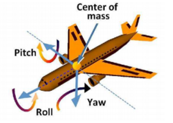
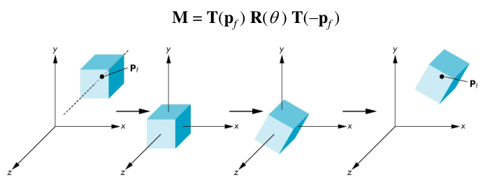

# 变换基础

## 二维变换

二维变换；线性变换==矩阵运算，缩放、反射、切变、旋转。

$\begin{aligned}
x^{\prime} & =a x+b y \\
y^{\prime} & =c x+d y \\
\end{aligned}$

$\begin{aligned}
{\left[\begin{array}{l}
x^{\prime} \\
y^{\prime}
\end{array}\right] } & =\left[\begin{array}{ll}
a & b \\
c & d
\end{array}\right]\left[\begin{array}{l}
x \\
y
\end{array}\right] \\
\mathbf{x}^{\prime} & =\mathbf{M} \mathbf{x}
\end{aligned}$

## 齐次坐标

> Homogeneous coordinates。

### Why

Q：为什么要引入齐次坐标？

A：平移变换不是线性变换，无法统一到二维操作中。

$\left[\begin{array}{l}
x^{\prime} \\
y^{\prime}
\end{array}\right]=\left[\begin{array}{ll}
a & b \\
c & d
\end{array}\right]\left[\begin{array}{l}
x \\
y
\end{array}\right]+\left[\begin{array}{l}
t_x \\
t_y
\end{array}\right]$

> 但是不希望把平移当做一种特殊的情况去考虑。

所以引入齐次坐标：可以把线性变换和平移（二者合起来就是仿射变换），用同一种形式去表示。

### What

二维的点、向量，增加一个维度。

$\begin{aligned}
& 2 D \text { point } & =(x, y, 1)^T \\
& 2 D \text { vector } & =(x, y, 0)^T
\end{aligned}$

二维点这样表示很”好”，增加了一个“1”的维度，可以表示平移变换，统一了线性变换和平移变换。

$\left(\begin{array}{c}
x^{\prime} \\
y^{\prime} \\
w^{\prime}
\end{array}\right)=\left(\begin{array}{ccc}
1 & 0 & t_x \\
0 & 1 & t_y \\
0 & 0 & 1
\end{array}\right) \cdot\left(\begin{array}{l}
x \\
y \\
1
\end{array}\right)=\left(\begin{array}{c}
x+t_x \\
y+t_y \\
1
\end{array}\right)$

> 增加维度“1”、“0”的理解：
>
> 1. 向量表示一个方向，具有平移不变性，也因此向量增加的维度是“0”；向量做任何平移变换操作时，就可以保证符合平移不变性。
> 2. 更深层次的理解，增加维度的“0”、“1”是有意义的。

齐次坐标下的二维点。

$\left(\begin{array}{c}
x \\
y \\
w
\end{array}\right) \text { is the } 2 \mathrm{D} \text { point }\left(\begin{array}{c}
x / w \\
y / w \\
1
\end{array}\right), w \neq 0$

### How

#### Scale

$\mathbf{S}\left(s_x, s_y\right)=\left(\begin{array}{ccc}
s_x & 0 & 0 \\
0 & s_y & 0 \\
0 & 0 & 1
\end{array}\right)$

#### Translation

$\mathbf{T}\left(t_x, t_y\right)=\left(\begin{array}{ccc}
1 & 0 & t_x \\
0 & 1 & t_y \\
0 & 0 & 1
\end{array}\right)$

#### Rotation

$\mathbf{R}(\alpha)=\left(\begin{array}{ccc}
\cos \alpha & -\sin \alpha & 0 \\
\sin \alpha & \cos \alpha & 0 \\
0 & 0 & 1
\end{array}\right)$

## 仿射变换

> Affine Transformation。

线性变换+平移变换；齐次坐标下，先线性后平移。

$\left(\begin{array}{l}
x^{\prime} \\
y^{\prime}
\end{array}\right)=\left(\begin{array}{ll}
a & b \\
c & d
\end{array}\right) \cdot\left(\begin{array}{l}
x \\
y
\end{array}\right)+\left(\begin{array}{l}
t_x \\
t_y
\end{array}\right)$

$\left(\begin{array}{l}
x^{\prime} \\
y^{\prime} \\
1
\end{array}\right)=\left(\begin{array}{ccc}
a & b & t_x \\
c & d & t_y \\
0 & 0 & 1
\end{array}\right) \cdot\left(\begin{array}{l}
x \\
y \\
1
\end{array}\right)$

## 逆变换

> Inverse transform。

## 组合变换

复杂的变换都是由简单的组合而来；变换的顺序很重要；**矩阵乘法无交换律**。

> e.g. 一个不在原点的做旋转
>
> 先变换到原点→旋转→转换回原来位置

## 三维变换

$\begin{aligned}
& 3 D \text { point }=(x, y, z, 1)^T \\
& 3 D \text { vector }=(x, y, z, 0)^T
\end{aligned}$

齐次坐标下，三维变换。

$\left(\begin{array}{l}
x^{\prime} \\
y^{\prime} \\
z^{\prime} \\
1
\end{array}\right)=\left(\begin{array}{lllc}
a & b & c & t_x \\
d & e & f & t_y \\
g & h & i & t_z \\
0 & 0 & 0 & 1
\end{array}\right) \cdot\left(\begin{array}{l}
x \\
y \\
z \\
1
\end{array}\right)$

### Scale

$\mathbf{S}\left(s_x, s_y, s_z\right)=\left(\begin{array}{cccc}
s_x & 0 & 0 & 0 \\
0 & s_y & 0 & 0 \\
0 & 0 & s_z & 0 \\
0 & 0 & 0 & 1
\end{array}\right)$

### Translation

$\mathbf{T}\left(t_x, t_y, t_z\right)=\left(\begin{array}{cccc}
1 & 0 & 0 & t_x \\
0 & 1 & 0 & t_y \\
0 & 0 & 1 & t_z \\
0 & 0 & 0 & 1
\end{array}\right)$

### Rotation

#### around axis

$\begin{aligned}
& \mathbf{R}_x(\alpha)=\left(\begin{array}{cccc}
1 & 0 & 0 & 0 \\
0 & \cos \alpha & -\sin \alpha & 0 \\
0 & \sin \alpha & \cos \alpha & 0 \\
0 & 0 & 0 & 1
\end{array}\right) \\
& \mathbf{R}_y(\alpha)=\left(\begin{array}{cccc}
\cos \alpha & 0 & \sin \alpha & 0 \\
0 & 1 & 0 & 0 \\
-\sin \alpha & 0 & \cos \alpha & 0 \\
0 & 0 & 0 & 1
\end{array}\right) \\
& \mathbf{R}_z(\alpha)=\left(\begin{array}{cccc}
\cos \alpha & -\sin \alpha & 0 & 0 \\
\sin \alpha & \cos \alpha & 0 & 0 \\
0 & 0 & 1 & 0 \\
0 & 0 & 0 & 1
\end{array}\right)
\end{aligned}$

#### Eular Angle

$\mathbf{R}_{x y z}(\alpha, \beta, \gamma)=\mathbf{R}_x(\alpha) \mathbf{R}_y(\beta) \mathbf{R}_z(\gamma)$

A rotation by q about an arbitrary axis can be decomposed into the concatenation of rotations about the x, y, and z axes。

> Note that rotations do not commute。

> Eular angle: composing rotations
>
> - pitch (up & down)
> - yaw (left & right)
> - roll (rolling)

> As regard to a camera, only concern about it's pitch and yaw.

#### Rodrigues Rotation

Rotation by angle $\alpha$ around axis $n$

$\mathbf{R}(\mathbf{n}, \alpha)=\cos (\alpha) \mathbf{I}+(1-\cos (\alpha)) \mathbf{n n}^T+\sin (\alpha) \underbrace{\left(\begin{array}{ccc}
0 & -n_z & n_y \\
n_z & 0 & -n_x \\
-n_y & n_x & 0
\end{array}\right)}_{\mathbf{N}}$

> n是旋转轴，alpha是旋转角度；默认n过原点，不是，则移到原点，再移回去。

> 1. Move fixed point to origin;
> 2. Rotate;
> 3. Move fixed point back.

#### 四元数

解决欧拉角Gimbal Lock的问题。

