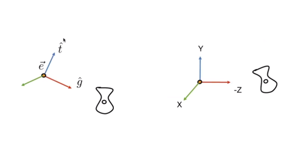
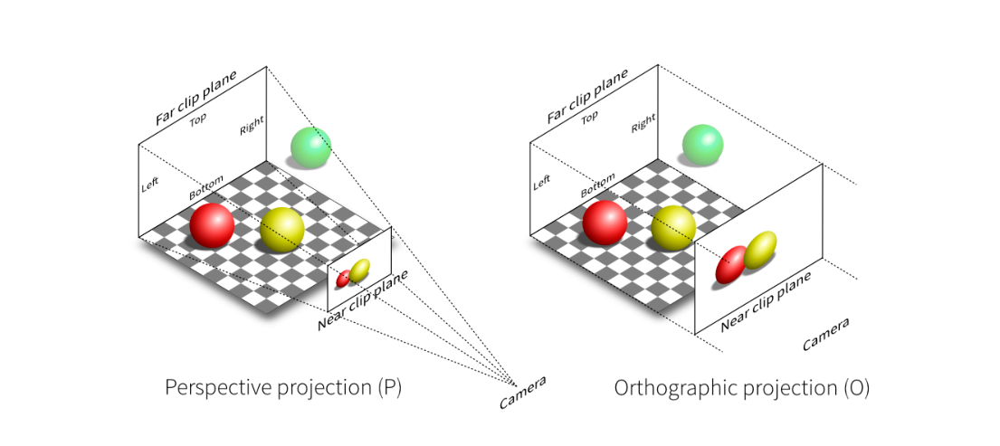
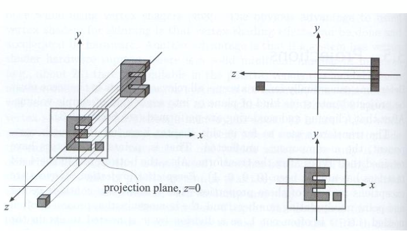
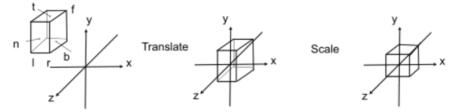
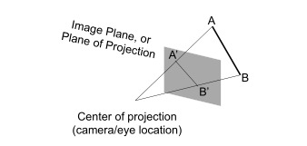
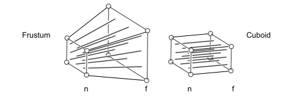
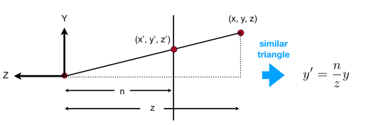
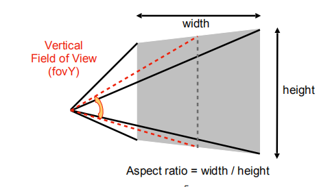
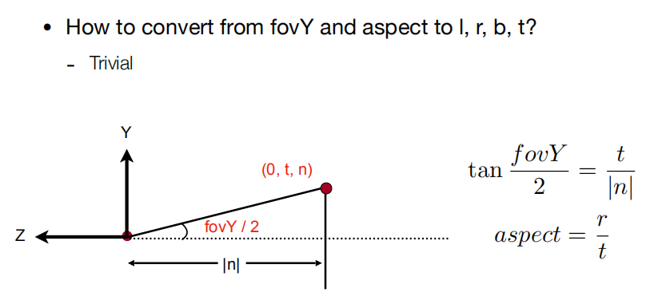

# MVP

> MVP的理解。

Model transformation (placing objects) 

找个好的地方，把所有人集合在一起，摆个pose！（把模型、场景搭好）

View transformation (placing camera) 

找一个好的角度/位置，把相机放好，往某一个角度去看。（改变的是相机）

Projection transformation 

茄子！

# View Transformation

## Why

放置相机，使更容易进行投影。

## How

Define the camera

* Position
* LookAt / graze direction
* Up direction

将相机永远放在默认位置，约定为原点，向着负z，向上为y；简化操作，但也带来了一定问题。

> 同时也要记得，objects一定要和相机做同样运动。

容易知道，将相机放到默认位置对应位置的操作，对应如下数学。

* Translate e to origin

* Rotates g to -Z
* Rotates t yo Y
* So (g×t) to X

$M_{\text {view }}=R_{\text {view }} T_{\text {view }}$

平移到原点

$T_{v i c w}=\left[\begin{array}{cccc}1 & 0 & 0 & -x_e \\ 0 & 1 & 0 & -y_e \\ 0 & 0 & 1 & -z_e \\ 0 & 0 & 0 & 1\end{array}\right]$

三个轴的旋转；正难则反

$R_{\text {view }}^{-1}=\left[\begin{array}{cccc}x_{\hat{g} \times \hat{t}} & x_t & x_{-g} & 0 \\ y_{\hat{g} \times \hat{t}} & y_t & y_{-g} & 0 \\ z_{\hat{g} \times \hat{t}} & z_t & z_{-g} & 0 \\ 0 & 0 & 0 & 1\end{array}\right]$ 

$R_{\text {view }}=\left[\begin{array}{cccc}x_{\hat{g} \times \hat{t}} & y_{\hat{g} \times \hat{t}} & z_{\hat{g} \times \hat{t}} & 0 \\ x_t & y_t & z_t & 0 \\ x_{-g} & y_{-g} & z_{-g} & 0 \\ 0 & 0 & 0 & 1\end{array}\right]$

> 正交矩阵（旋转矩阵）的逆就是其转置。

> 模型变换和视图变换经常被一起叫作模型视图变换，Also know as ModelView Translation。

# Projection Transformation 

3D→2D

* Orthographic
* Perspective

## Orthographic

一个简答的理解

- Camera located at origin, looking at -Z, up at Y (looks familiar?)
- Drop Z coordinate
- Translate and scale the resulting rectangle to [-1, 1]^2

也就是将空间里的任意几何体，映射到“标准立方体”；把z坐标扔掉即可得到，但并不方便，还有正式做法。

> 如果区分物体前后？后面会说。

只需要六个数就可以映射到NDC空间中，先平移再缩放；map a cuboid [l, r] x [b, t] x **[f, n]** to the “canonical” cube [-1, 1]^3。

> 一个小的注意点，实际上屏幕向里向着负Z轴，所以反而是远的z值小，近大。
>
> OpenGL投影后的坐标系是左手的，屏幕向里向着正Z轴。（left hand coords）

容易知道，先平移再缩放即可。

$M_{\text {ortho }}=\left[\begin{array}{cccc}\frac{2}{r-l} & 0 & 0 & 0 \\ 0 & \frac{2}{t-b} & 0 & 0 \\ 0 & 0 & \frac{2}{n-f} & 0 \\ 0 & 0 & 0 & 1\end{array}\right]\left[\begin{array}{cccc}1 & 0 & 0 & -\frac{r+l}{2} \\ 0 & 1 & 0 & -\frac{t+b}{2} \\ 0 & 0 & 1 & -\frac{n+f}{2} \\ 0 & 0 & 0 & 1\end{array}\right]$

## Perspective

### What

近大远小；Parallel lines not parallel; converge to single point。

### How

一个感性认知，First “squish” the frustum into a cuboid, then do orthographic projection.

挤压过程，近平面不变；而对于远平面的z值不变，远平面的中心不变。

Recall the key idea: find the relationship between transformed points (x’, y’, z’) and the original points (x, y, z).

首先y之间肯定会有对应关系，看远平面边的例子。

x同理。

$y^{\prime}=\frac{n}{z} y \quad x^{\prime}=\frac{n}{z} x$

在齐次坐标下，虽然z的变化尚且不确定，有变换。

$\left(\begin{array}{l}x \\ y \\ z \\ 1\end{array}\right) \Rightarrow\left(\begin{array}{c}n x / z \\ n y / z \\ \text { unknown } \\ 1\end{array}\right)==\left(\begin{array}{c}n x \\ n y \\ \text { still unknown } \\ z\end{array}\right)$

对于结果项所有项同时×z，则经过向量得到右边最终的向量。

于是对于以下变换式子

$M_{\text {persp } \rightarrow \text { ortho }}^{(4 \times 4)}\left(\begin{array}{l}x \\ y \\ z \\ 1\end{array}\right)=\left(\begin{array}{c}n x \\ n y \\ \text { unknown } \\ z\end{array}\right)$

足够得到一部分变换矩阵。

$M_{\text {persp } \rightarrow \text { ortho }}=\left(\begin{array}{cccc}n & 0 & 0 & 0 \\ 0 & n & 0 & 0 \\ ? & ? & ? & ? \\ 0 & 0 & 1 & 0\end{array}\right)$

对于剩下的第三行，已经知道有近平面的点不会发生变化，远平面的点的z不会发生变化。

对于近平面，凑出来nxny等同于变换式子最终项的格式。

$\left(\begin{array}{l}x \\ y \\ n \\ 1\end{array}\right) \Rightarrow\left(\begin{array}{l}x \\ y \\ n \\ 1\end{array}\right)==\left(\begin{array}{l}n x \\ n y \\ n^2 \\ n\end{array}\right)$

所以第三行必须是如下格式。

$\left(\begin{array}{llll}0 & 0 & A & B\end{array}\right)\left(\begin{array}{l}x \\ y \\ n \\ 1\end{array}\right)=n^2$

对于AB得到

$A n+B=n^2$

又对于远平面，只取远平面中心，其位置没有发生变化。

$\left(\begin{array}{l}0 \\ 0 \\ f \\ 1\end{array}\right) \Rightarrow\left(\begin{array}{l}0 \\ 0 \\ f \\ 1\end{array}\right)==\left(\begin{array}{c}0 \\ 0 \\ f^2 \\ f\end{array}\right)$

对于AB得到

$A f+B=f^2$

于是有

$\begin{aligned} & A=n+f \\ & B=-n f\end{aligned}$

得到变换矩阵，最后做正交投影即可，$M_{\text {persp }}=M_{\text {ortho }} M_{\text {persp } \rightarrow \text { ortho }}$。

# Viewport Transformation

> 定义frustum，只需要定义fovY（垂直可视视角）和ratio（宽高比），就可以导出lrbt。

转换到lrbt。

MVP后，Canonical Cube to Screen，先不管z，也就是[-1,1]^2 to [0, width] x [0, height]。

$M_{\text {viewport }}=\left(\begin{array}{cclc}\frac{\text { width }}{2} & 0 & 0 & \frac{\text { width }}{2} \\ 0 & \frac{\text { height }}{2} & 0 & \frac{\text { height }}{2} \\ 0 & 0 & 1 & 0 \\ 0 & 0 & 0 & 1\end{array}\right)$

> 定义Screen
>
> * 二维数组
>
> * 数组中每个元素代表像素
>
> > 屏幕实际上是光栅成像设备。
>
> 像素
>
> * For now: a little square with uniform color
> * Color is a mixtrue of (red, green, blue)
>
> 屏幕空间
>
> 认为屏幕左下角是原点，向右是x，向上是y。

> 一些约定：
>
> * Pixel's indices (x, y)；x和y都是整数
> * 所有像素表示，(0, 0) to (width-1, height-1)
> * 像素中心，(x+0.5, y+0.5)
> * 整个屏幕覆盖，(0, 0) to (width, height)