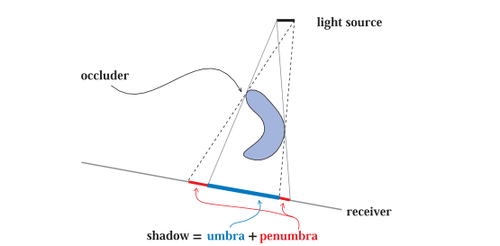
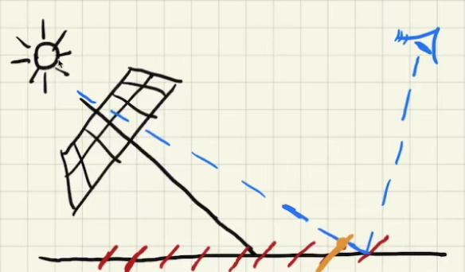
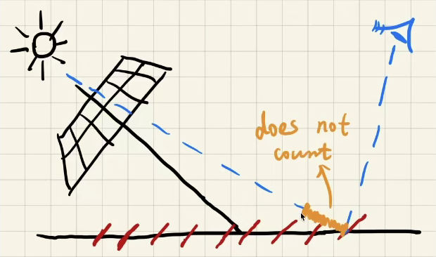
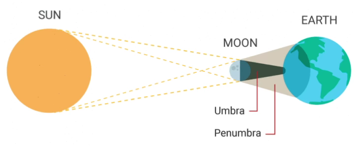
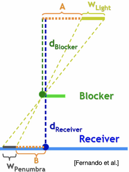
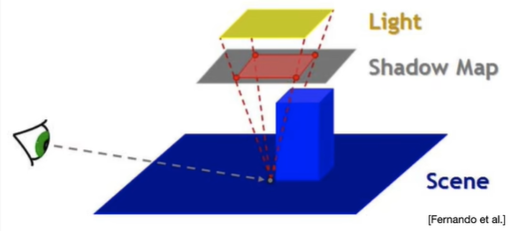

# SM

## 本影与半影



精准光源（punctual light source），生成硬阴影（hard shadows）；面光源产生软阴影（soft shadows），阴影 = 本影 + 半影。

## 2-pass Algorithm

简而言之，第一次从light看向场景渲染生成深度图，第二次：从camera处看场景（进行渲染），这个过程使用深度图判断物体是否处于阴影中。

### 1st

render from light, to get the depth texture.

Code: create a virtual camera at the light source→MVP→to get the depth buffer from the light's point-of-view→output a depth texture.

> 深度图记录的是，每个像素中他们各自看到的最浅的深度即最近物体的距离。

### 2nd

render from eye, project visible points in eye view back to light source, to compute the distance from each fragment to the light source.

compare, to get visible or blocked.

> 注意透视投影后的z（z after MVP）和实际到light的距离（linear distance）是不一样的，一致即可。

```
if depthInShadowMap < PositionToLight.z
    return blocked
return visible
```

> Visualizing Shadow Mapping
>
> - position->NDC[0,1]
> - (255.0,255.0,255.0) * position.z
>
> 

## pros & cons

### pros

快；使用记录的深度图。

### cons

cons1: self-occlusion/self-shadowing

> 表现类似于摩尔纹。



在SM下，场景是离散的小片；会导致这样一种现象：从camera看向场景的小片时，该小片连向light，会被误认为被前面的小片遮挡，产生错误的阴影；容易知道，light incident从上向下，问题最小，light incident接近和地面平行时（grazing angle），self-occlusion最严重。

解决方法：使记录深度明显得比实际深度小；具体方法：使一个点深度大于记录深度的值超过一个阈值时，才认为这个点在阴影内；Adding a variable bias (slope scale based depth bias)。

> 但是bias会引入detached shadow issue，表现为阴影偏移（Peter Panning）。



使bias与接收器对光的角度成比例（normal incident影响小而horizontal incident影响大）；slope scale based depth bias = factorSlope * slope + constantBias；slope: determined by the normal。

> RTR does not trust in COMPLEXITY.

cons2: Aliasing

the resolution of the Shadow Map，对场景具有分辨率的表现。

解决方法：Cascaded Shadow Map（工业界）。

## 数学原理

> 详细说下SM背后的数学，为后面内容做准备。

An important approximation through RTR, by the way, care more about "approximately equal".

$\int_{\Omega} f(x) g(x) \mathrm{d} x \approx \frac{\int_{\Omega} f(x) \mathrm{d} x}{\int_{\Omega} \mathrm{d} x} \cdot \int_{\Omega} g(x) \mathrm{d} x$

两个函数乘积的积分 ≈ 两个函数积分的乘积，肯定不正确，但希望给出限定条件下，近似正确；分母的含义，是一个归一化常数。

对以上近似，有结果近似正确的条件：g(x)积分的support较小（实际积分范围较小）；或者g(x)在积分域上足够smooth光滑（变动不大），并不是指连续性，而是低频。

rendering equation **with explicit visibility**, 

$L_o\left(\mathrm{p}, \omega_o\right)=\int_{\Omega^{+}} L_i\left(\mathrm{p}, \omega_i\right) f_r\left(\mathrm{p}, \omega_i, \omega_o\right) \cos \theta_i V\left(\mathrm{p}, \omega_i\right) \mathrm{d} \omega_i$

拆出V项，有以上“好”的近似，可以得到

$L_o\left(\mathrm{p}, \omega_o\right) \approx \frac{\int_{\Omega^{+}} V\left(\mathrm{p}, \omega_i\right) \mathrm{d} \omega_i}{\int_{\Omega^{+}} \mathrm{d} \omega_i} \cdot \int_{\Omega^{+}} L_i\left(\mathrm{p}, \omega_i\right) f_r\left(\mathrm{p}, \omega_i, \omega_o\right) \cos \theta_i \mathrm{~d} \omega_i$

前半项是做归一化处理的visibility，后半项是shading；对于每一点的结果，是计算出的shading×visibility的结果，正是做SM的思路。

保证该近似（计算）正确的条件：控制积分域足够小，也就是只有点光源或者方向光源；shading部分smooth→brdf的变化足够小→假设一个面光源，即保证光源各处的radience变化也不大，且brdf diffuse。

> 两个条件具备一个即可，Ambient Occlusion还会用到该思路。

# PCF

## 软阴影

> SM只给出硬阴影。



半影区域上看向面光源，部分遮挡，部分未遮挡。

## 原理

percentage closer filter，其实起初是对阴影边界反走样（抗锯齿）的方法，后买你发现可以用在软阴影的实现上。具体实现：filtering（其实这里只是求了个平均） the results of shadow comparisons。

> not filter the shadow map；和模糊了的深度做出来深度测试仍然是非0即1的，没有意义；当然也不是在最后的结果上做模糊出效果。

SM的基本思想：判断一个点是否在阴影中，从shading point连向light然后跟Shadow map对应的这一点深度比较判断是否在阴影内；那么在PCF中，仍然要进行比较，来判断是否在阴影中，这里把其投影到light之后不再只找其对应的单个像素，而是找其周围一圈像素，把周围像素比较的结果加起来平均，得到一个0~1之间的数，用于得到结果。

> 可以加权。

## 算法

对范围内的像素分别进行深度值比较，对比较的结果（01值）进行加权平均（这时候不再是非0即1的了）。

PCF filter size，small→sharper，large→softer；而软阴影实际上就是对硬阴影做大的filter；在不同的位置将硬阴影转化为软阴影，且不同位置不同filter_size，和遮挡物距离（blocker distance）相关。

# PCSS

## 原理

Percentage Closer Soft Shadows，Filter size应该和blocker distance相关；blocker distance: relative average projected blocker depth。



W_Penumbra代表“软”的程度，部分由光源决定。当遮挡物靠近接受物（平面），容易想到，“软”的范围也会变小。

数学形式如下，一个简单的相似三角形。

$w_{\text {Penumbra }}=\left(d_{\text {Receiver }}-d_{\text {Blocken }}\right) \cdot w_{\text {Light }} / d_{\text {Blocker }}$

> 需要filter的大小，取决于light和blocker，而blocker的形状可能会有区别，所以要average，对于shading point，要看一定范围有多少遮挡，对这些做average。

> 面光源生成SM的问题，实际上是模拟为点光源（例如camera放在面中间），生成。

## 算法

Step1: Blocker Search

getting the average blocker depth **in a certain region**

Step2: Penumbra estimation

use the average blocker depth to determine **filter size**

Step3: PCF

给出硬阴影该Filter多大，就完全转化为PCF问题了。

> 本质：求出了阴影中需要做PCF的半影部分后再进行PCF的计算；动态设置了PCF的搜索范围→动态调节了半影范围，也就是实现了硬阴影部分清晰，软阴影部分模糊。

## 问题

### 遮挡物距离光源的距离

如何确定一个blocker距离光源的位置？

直观上，如果比较结果显示该点被阻挡，那么所记录深度应该就是遮挡物深度；从shading point连向点光源，取周围区域判断是否在阴影中（in a certain region）即可。

然而，blocker可能是物体（有一定深度区别），所以不能直接使用shadow map中对应单个点的深度来代表blcoker距离，如果该点的深度与周围点的深度差距较大（例如表面陡峭或者对应点正好有一个孔洞），选择使用平均遮挡距离（average blocker depth）。

求blocker距离（平均遮挡距离）的具体方法：把目标shading point转换到light space找到shading point在shadow map上对应的像素；如果shading point的深度大于这个shadow map上点对应的深度，那么该像素所对应的点是一个Blocker，**取shadow map上这个像素周围的一些像素**，找出能够挡住shading point的点的像素，求其平均深度值作为blocker的深度。

> 但是这里仍然需要一个“范围”，需要使用blocker distance去确定filter size，然而blocker distance本身的计算就需要一个"范围"，转进到下个问题。

### 遮挡物查询的范围

如何确定一个大概的范围判断是否是Blocker呢？

即确认“取shadow map上这个像素周围的一些像素，找出能够挡住shading point的点的像素”这一步的寻找范围大小。两种方法，取固定大小范围；heuristics: depends on the light size and receiver's distance from the light。



> 认为SM放在近平面上。

计算shadow map的时候在光源处设置过相机，并把shadow map放在由相机看向场景形成的视锥中的近截面上；将光源shading point相连，在shadow map上截出来的面就是要查询计算平均遮挡距离的部分。这部分的深度求一个均值，就是Blocker到光源的平均遮挡距离。

这种方法make sense在于离光源越远，遮挡物也会更多，所以需要在Shadow map上的一个小区域内查找blocker；离光源越近，遮挡物会少，所以需要在Shadow map上的一个大区域内查找blocker；且近的物体相对变大，其自身形状也需求大范围的检查。

## 缺点

确定Blocker需要一遍访问次数；PCF又要对这个特定区域走一遍；对于多光源，需要逐个处理；且线性时间。存在各种方法处理。

## 数学原理

> Also a deeper look at PCF.

Filter / Convolution

$[w * f] (p)=\sum_{q \in \mathcal{N}(p)} w(p, q) f(q)$

对于f做卷积w，定义为对任意像素p，取邻域N(p)任意点q，点q值按pq值（距离）作加权并写回，也就是**加权平均**。

In PCSS

$V(x)=\sum_{q \in \mathcal{N}(p)} w(p, q) \cdot \chi^{+}\left[D_{\mathrm{SM}}(q)-D_{\text {scene }}(x)\right]$

对

右边：CHI函数：符号函数（阶梯函数）

变量>0，那么值为1

<0，那么值为0

即阴影比较的结果

左边：权值/其实不加权也可以


## 改进


