# Header

## C vs. C++

### C vs. C++

C面向过程而C++面向对象。

> C++面向对象的关键：类的引入，类的封装性、继承性、多态性简化了程序编写，提到了代码重用率。

C的目的：比汇编方便易用，同时不要损失汇编的表达能力；因此简单容易编译，灵活贴近底层。

C++的目的：提高编程人员的生产率，哪怕代价是增加编译器的复杂度；提高编程人员生产率的方法有如下几种：提高抽象层次、支持模块化编程、自动化代码生成。

> C++不仅仅是面向对象，其目的也在于支持泛型编程。

### Object Oriented

Object Based：面对的是单一的Class的设计；Object Oriented：面对的是Classes的设计，classes和classes之间的关系。

Classes的两个经典分类：Class without pointer members、Class with pointer member。

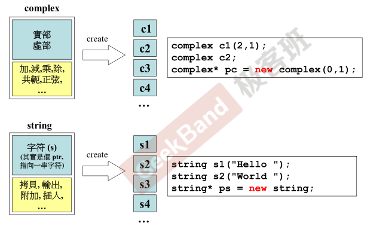

> String数据内部只有一个指针，采用动态分配内存，该指针就指向动态分配的内存。

### C++ programs

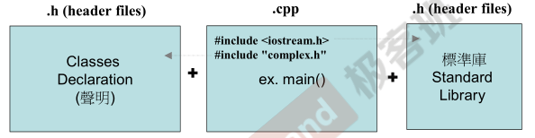

> 延伸文件名不一定是.h或.cpp，也可能是.hpp（头文件和主程序放在一个文件中实现）。

### Output

向左cout“丢”（<<）即可

## Header

防止此头文件被重复包含。

```cpp
#ifdef _COMPLEX_
#define _COMPLEX_

#endif
```

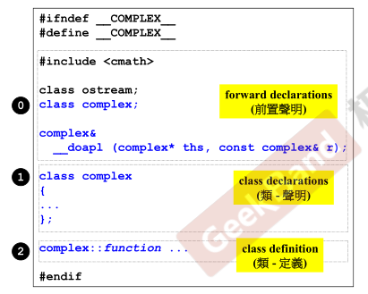

## More

### template

如果把私有数据的类型写死了，定义示例的时候，数据类型受到限制。所以需要写一个模板类（含模板的类）。T写成什么都可以。

```cpp
#pragma once
template <typename T>
class complex
{
public:
    complex(T r = 0, T i = 0) : re(r), im(i)
    {
    }
    complex &operator+=(const complex &);
    T real() const { return re; }
    T imag() const { return im; }

private:
    T re, im;

    friend complex &__doapl(complex *, const complex &);
};

{
    complex<double> c1(2.5, 1.5);
    complex<int> c2(2, 6)
}
```

> 使用时绑定类型。

### inline functions

```cpp
class complex {
public:
    complex(double r = 0, double i = 0) : re(r), im(i) {}
    complex &operator+=(const complex &);
    complex &operator-=(const complex &);
    complex &operator*=(const complex &);
    complex &operator/=(const complex &);
    double real() const { return re; }
    double imag() const { return im; }

private:
    double re, im;

    friend complex &__doapl(complex *, const complex &);
    friend complex &__doami(complex *, const complex &);
    friend complex &__doaml(complex *, const complex &);
};
```

```cpp
inline double imag(const complex &x) { return x.imag(); }
```

**inline**；快（但是最后是否inline由编译器决定）；复杂时还是需要定义在外部。

函数在class body内完成，自动称为inline候选人。

### access level

数据部分一般private；如果函数是要被外界调用的就放在public，若不打算被外界调用则放在private。即分为public给外界使用、private处理内部数据。

> 尽量使外界通过方法“拿”数据，而不是直接访问。
>
> ```cpp
> // bad
> cout << c1.re;
> cout << c1.im;
> // good
> cout << c1.real();
> cout << c1.imag();
> ```

# Functions

## Ctor

C++在利用类名创建一个对象的时候，有一个函数会被自动调用，这个函数就是构造函数。

构造函数的特点：

- 没有返回值类型，也不需要有；
- 构造函数的函数名必须和类名一致；
- 构造函数的参数可以有默认值；
- 用创建实例的时候传递进来的参数值去初始化私有变量；只有构造函数才有初始列表，使用初始列表进行数据的初始化比使用赋值进行值的设定的效率更高。


> 本类中没有指针变量，一般这种没有指针的类多半不需要写析构函数。

## Overloading

> 构造函数可以有很多个。

重载（overloading），创建对象可以多种构造方法。

> Q：为什么可以有同名函数？
>
> 编译器编译后的函数名称不同。

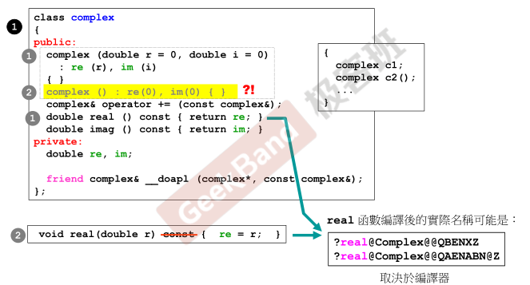

构造函数的重载，在使用类创建对象的时候，有多少个想法就可以创建多少个”**形状不同**“的构造函数，形状不同指的是函数参数个数不同。

非构造函数的重载，编译器会把它们编译成名字不同的函数。

## Singleton

构造函数放在private区，不能被外界直接调用的；也就是无法在外界创造对象；单例模式。

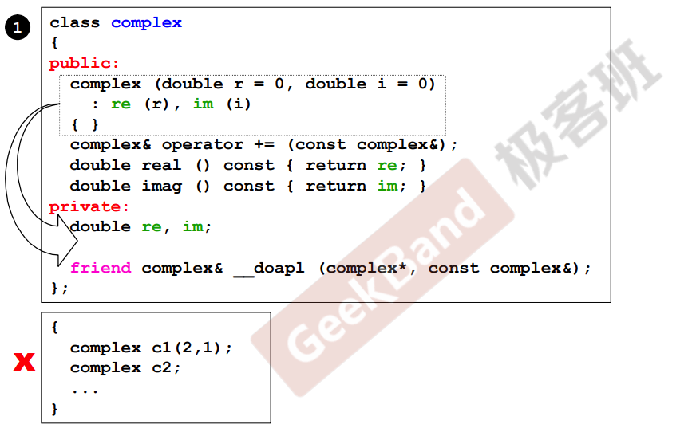

Singleton单键（外界只可以用一份）；构造函数位于private中；外界不可以创建，外界需要（自己在内部准备了一份），外界需要通过A的getInstance取到该单个对象。

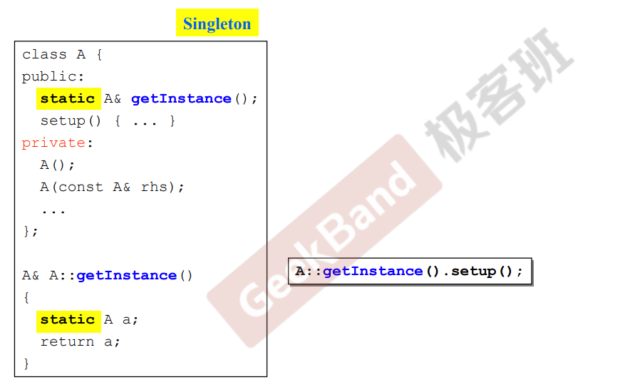

## Const Member Functions

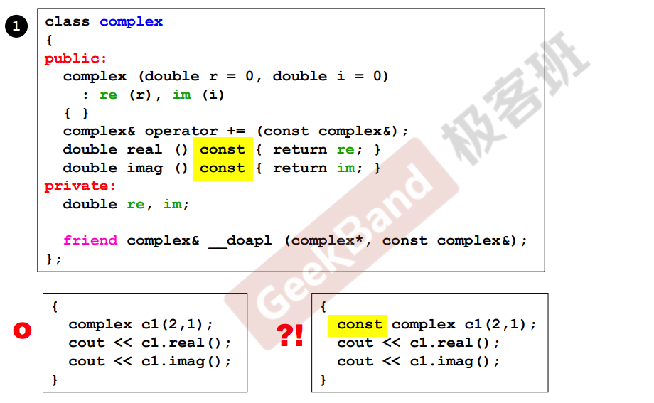

const修饰成员函数，要在如上图的位置；修饰不会改变数据内容的函数；const对象一定只能调用const方法。

> 关于不会改变数据内容的函数加const的解释，上面这两个函数只是把函数的实部和虚部拿出来，并不是写，不写就不会改变私有数据，所以可以定义成常量成员函数。

### const functions

所谓常量成员函数就是不改变私有数据的成员函数，表面上看的话就是函数名和作用域之间加上const修饰符的函数，加const就意味着不打算改变私有数据。

换而言之，不改变私有数据就一定要加上const；能加就加，因为不加的话可能会产生不希望的后果。

```
const complex c1(2, 1);
```

举例，这里const表示创建复数对象的时候，数据不可以被改变；但是假如调用函数real()的时候，real()函数前面没有加const，就会产生矛盾，因为没有用const修饰的函数意味着进来的数据有可能被改变。

### const members

const修饰成员函数其实修饰的是隐式参数this指针，因此（由对象产生的）传入参数需要和this指针匹配，即const对象所调用的方法传入的是const对象指针，而非对象指针。也因此，const对象不可以调用非const成员函数。


# Operator Overloading

> 可以重载为成员函数或者是非成员函数。

## Member Functions

在C++里面，操作符是一种函数，这是C++的一大特点。

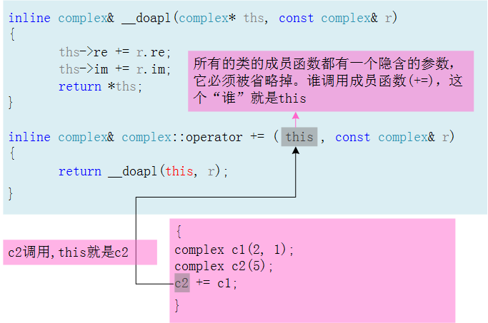

> 操作符重载的原因：因为函数库中没有两个复数直接相加的函数，只有实数和实数相加的函数。

对于成员函数+=：c2调用了+=（+=作用在c2身上），c2需要写出函数来进行正确调用；c2就是this，或者说this此时就指向了c2（this是一个指针），c2的地址传入了this。

> 任何函数都隐藏this参数。

> _doapl：再次调用 _dopal；也许是其他地方也要使用，所以写成单独的方法。

## Non-Member Funcitions

> 无隐含参数this（指针）。

> **类外区域**，主要有成员函数、全局函数。
>
> 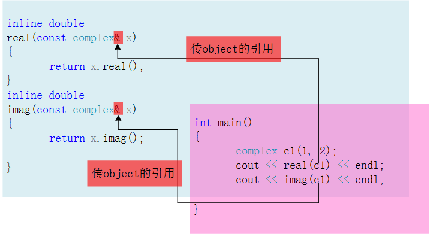
>
> > 两个全局函数（没有class的名称），目的是取得复数的实部、虚部。

为了应付用户的3种可能用法，需要在类区域（class body）外写3个对应的处理加法的函数；以下123仅用作标识。

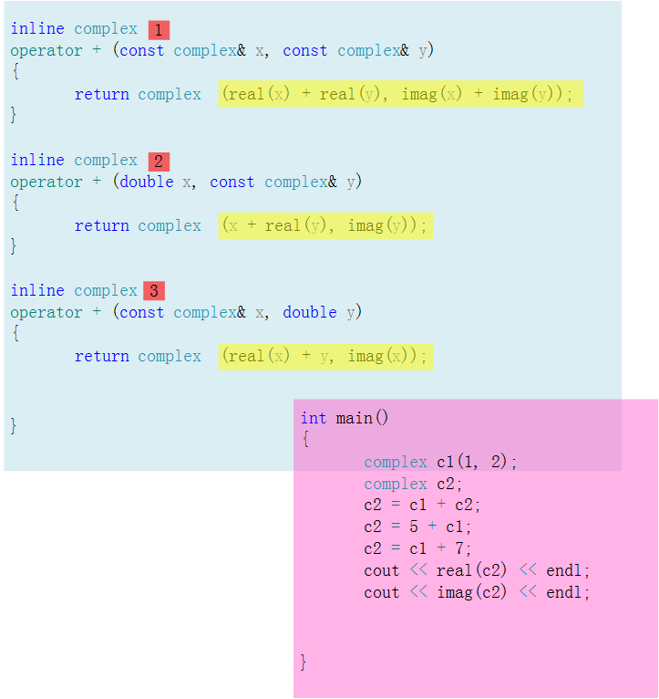

## Return by reference

> 尽量return by reference。

写一个函数一般考量两个点，这两点影响着程序执行的效率：参数传递要不要by reference；返回值传递要不要by reference。

如果return by reference，传递者无需知道接收端是以by reference还是by value的形式接受object。

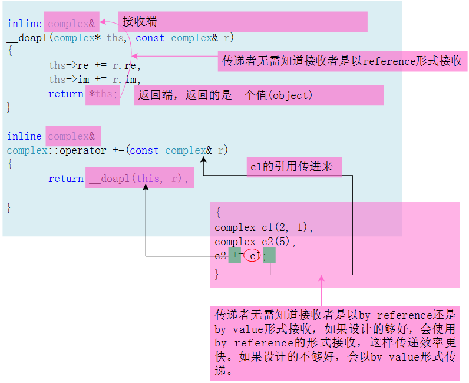

返回`*ths`（也就是一个object、返回值），接收用complex&接收；但是其实`*ths`处不需要管接收用什么接收。

> 当然还是引用接收好，快。

有关返回值是写void还是写一个具体类型，视具体情况定。

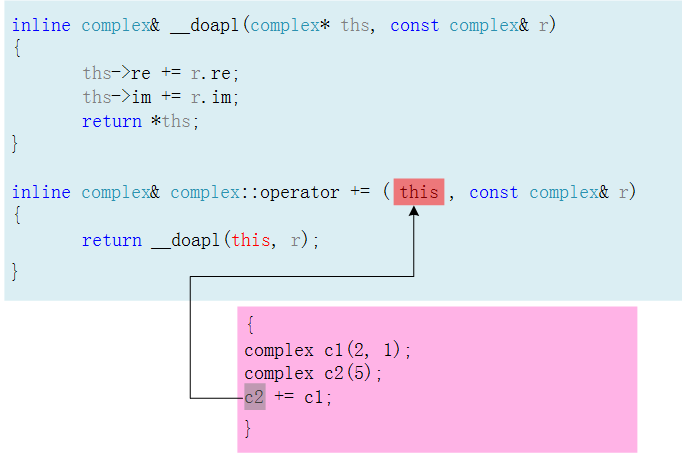

返回值是写void还是写一个具体类型；如果使用者只是这样调用+=这个重载函数：c2+=c1，那么返回类型complex&写成void是没有问题的。

但如果这样调用：c3+=c2+=c1，返回void类型的话，就有问题了；希望c1先加到c2上，再将上述操作的返回值加到c3上。

## Temp Object

> temp object。


这些函数绝对不可以return by reference，因为，它们返回的必定是个local object，出去就不存在了，所以一定要return by value。

```
// （类名后面+小括号）
typename();
```

这是一个特殊语法，是创建临时对象的特殊语法。举例，函数体中的complex()就是在创建临时对象，临时对象的生命周期就是这创建的那一行，到下一行生命就结束了。

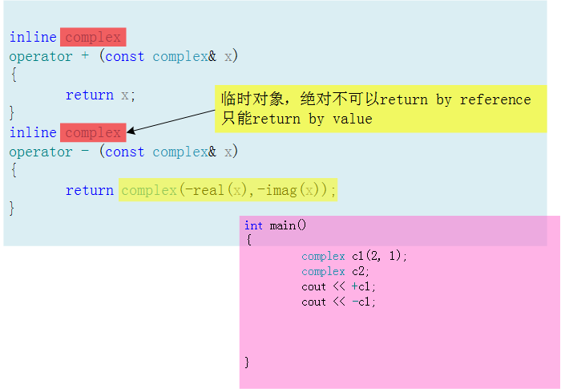

> 第一个正号操作，返回的是原来的东西，没有产生新的东西（新的local object，而下面代码中取反的操作产生了新的东西），那完全可以retrun by reference啊，这个是标准库里面的东西，那么厉害的人会注意不到这一点吗？有可能。这里其实可以retrun by reference。complex后面可以加个&。（错误观点！）

因为传入的参数是const类型的引用，如果将返回值改成引用，相当于将const类型转换为非const类型，这在编译上是通不过的。

## Output Overloading

> 单独拿出来，举例。


> 运算符永远是作用在左边的对象上，没有作用在右边上的。

### params

参数传递，均是pass by reference；x没有改变，const，但是os传进来需要改变，每一次输出都在改变状态，不可以const；“<<”是双目运算符，需要提供2个参数。

### return by reference

返回值传递，return by reference；如果不是连续输出，函数的返回值类型可以设计成void，如果使用连续输出，函数的返回值类型不能是void类型；返回类型前不可以加"const"，因为连续输出的时候被丢到屏幕上的东西一直在变，即每有一个新的输出变量“os”的状态就会发生变化（也是由于这个原因，ostream& os的前面不可以加const修饰符），相当于一个变量的值一直在发生变化。

## non-member functions

<<不可以写成成员函数，操作符重载一定左边上，正常使用习惯是<<作用到左边的cout身上；如果写成成员函数，`c1 << cout;`，不符合使用习惯。

> 任何一个操作都可以设置为成员函数或者全局函数；看情况。