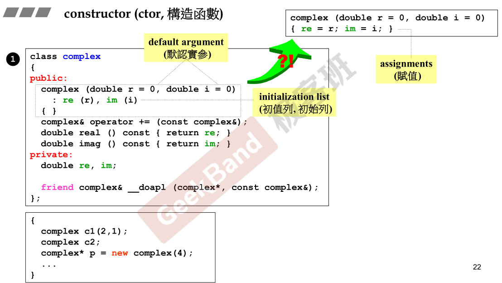
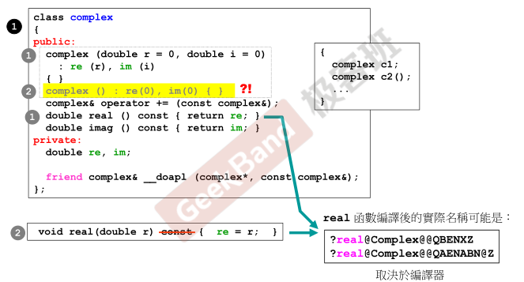
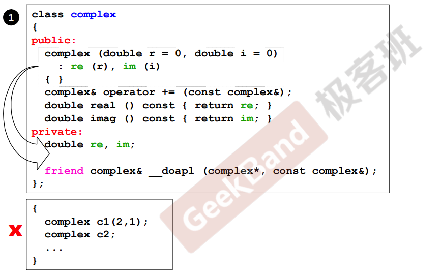
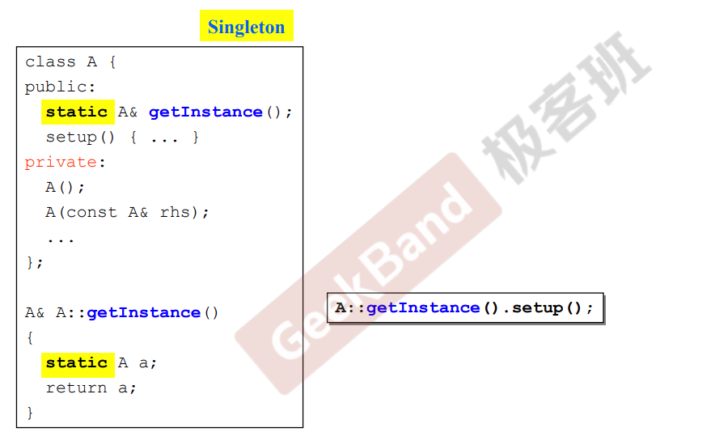
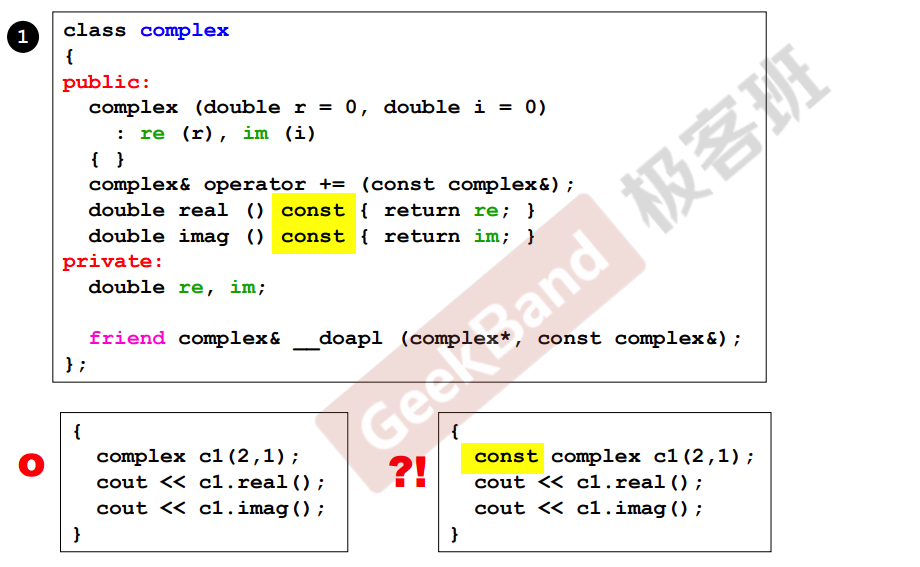

# 构造函数

C++在利用类名创建一个对象的时候，有一个函数会被自动调用，这个函数就是构造函数。

构造函数的特点：

- 没有返回值类型，也不需要有；
- 构造函数的函数名必须和类名一致；
- 构造函数的参数可以有默认值；
- 用创建实例的时候传递进来的参数值去初始化私有变量；只有构造函数才有初始列表，使用初始列表进行数据的初始化比使用赋值进行值的设定的效率更高。



> 本类中没有指针变量，一般这种没有指针的类多半不需要写析构函数。

# 重载

> 构造函数可以有很多个。

重载（overloading），创建对象可以多种构造方法。

> Q：为什么可以有同名函数？
>
> 编译器编译后的函数名称不同。



## 构造函数的重载

在使用类创建对象的时候，有多少个想法就可以创建多少个”**形状不同**“的构造函数，形状不同指的是函数参数个数不同。

## 非构造函数的重载

编译器会把它们编译成名字不同的函数。

# 单例模式

构造函数放在private区，不能被外界直接调用的；也就是无法在外界创造对象；单例模式。



Singleton单键（外界只可以用一份）；构造函数位于private中；外界不可以创建，外界需要（自己在内部准备了一份），外界需要通过A的getInstance取到该单个对象。



# 常量成员函数

> const member functions。



const修饰成员函数，要在如上图的位置；修饰不会改变数据内容的函数；const对象一定只能调用const方法。

> 关于不会改变数据内容的函数加const的解释，上面这两个函数只是把函数的实部和虚部拿出来，并不是写，不写就不会改变私有数据，所以可以定义成常量成员函数。

## const函数

所谓常量成员函数就是不改变私有数据的成员函数，表面上看的话就是函数名和作用域之间加上const修饰符的函数，加const就意味着不打算改变私有数据。

换而言之，不改变私有数据就一定要加上const；能加就加，因为不加的话可能会产生不希望的后果。

```
const complex c1(2, 1);
```

举例，这里const表示创建复数对象的时候，数据不可以被改变；但是假如调用函数real()的时候，real()函数前面没有加const，就会产生矛盾，因为没有用const修饰的函数意味着进来的数据有可能被改变。

## const成员

const修饰成员函数其实修饰的是隐式参数this指针，因此（由对象产生的）传入参数需要和this指针匹配，即const对象所调用的方法传入的是const对象指针，而非对象指针。也因此，const对象不可以调用非const成员函数。
