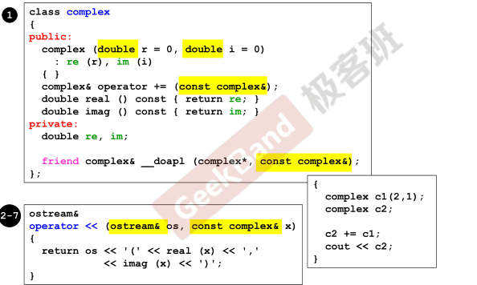
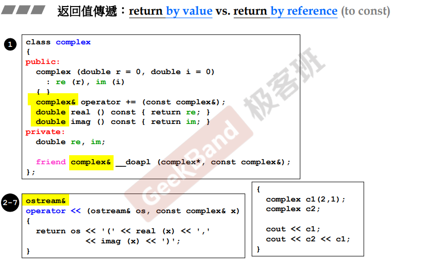
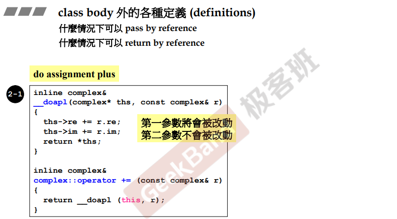
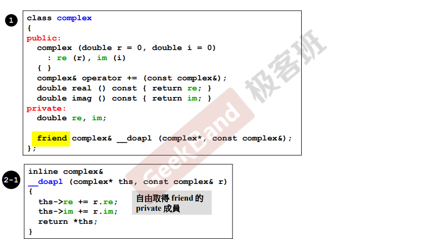
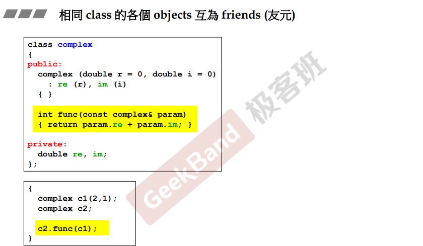

# 参数传递

## 参数传递

> pass by value vs. pass by reference（to const）

pass by value，压到函数的栈中（整包传过去），尽量不要，字节数（可能比较大）不定；pass by reference，C可以传指针，C++传reference（引用在底层就是指针）。

> 引用，方法内改变则会影响原值，如果只是为了传输的速度，不希望进行改变，就用pass by reference to const。

> 一般来说，基础数据类型传值，自定义类型传引用。

## 返回值传递

> pass by value or pass by reference(to const)

同上，考虑到效率，pass by reference。

## 不能返回局部变量的引用

函数之间在进行参数传递和值传递的时候，都是要尽量传递引用；但是有一种情况不能传递引用，这就是值被赋给一个函数内的临时变量的时候，因为临时变量的生命周期只在函数内，不在函数外。

举例，ths本来就在，是非临时变量，所以可以传引用。

# 友元函数

声明后，可以自由取得该声明所在类的私有变量。

