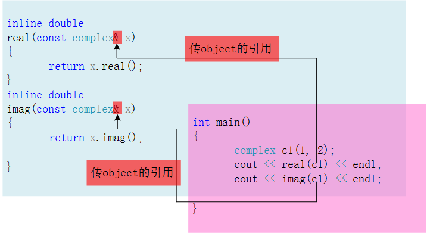
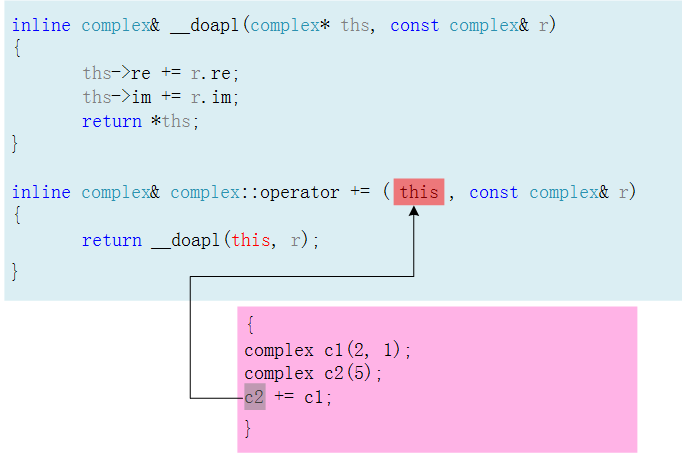
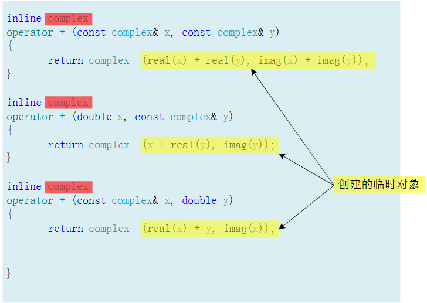
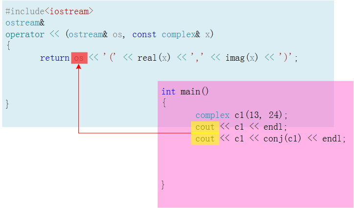

# 操作符重载

> 可以重载为成员函数或者是非成员函数。

## 成员函数

在C++里面，操作符是一种函数，这是C++的一大特点。


> 操作符重载的原因：因为函数库中没有两个复数直接相加的函数，只有实数和实数相加的函数。

对于成员函数+=：c2调用了+=（+=作用在c2身上），c2需要写出函数来进行正确调用；c2就是this，或者说this此时就指向了c2（this是一个指针），c2的地址传入了this。

> 任何函数都隐藏this参数。

> _doapl：再次调用 _dopal；也许是其他地方也要使用，所以写成单独的方法。

## 非成员函数

> 无隐含参数this（指针）。

> **类外区域**，主要有成员函数、全局函数。
>
> 
>
> > 两个全局函数（没有class的名称），目的是取得复数的实部、虚部。

为了应付用户的3种可能用法，需要在类区域（class body）外写3个对应的处理加法的函数；以下123仅用作标识。


# 注意事项

## 尽量return by reference

写一个函数一般考量两个点，这两点影响着程序执行的效率：参数传递要不要by reference；返回值传递要不要by reference。

如果return by reference，传递者无需知道接收端是以by reference还是by value的形式接受object。


返回`*ths`（也就是一个object、返回值），接收用complex&接收；但是其实`*ths`处不需要管接收用什么接收。

> 当然还是引用接收好，快。

## 返回值是写void还是写一个具体类型



返回值是写void还是写一个具体类型；如果使用者只是这样调用+=这个重载函数：c2+=c1，那么返回类型complex&写成void是没有问题的。

但如果这样调用：c3+=c2+=c1，返回void类型的话，就有问题了；希望c1先加到c2上，再将上述操作的返回值加到c3上。

# 临时对象

> temp object。



这些函数绝对不可以return by reference，因为，它们返回的必定是个local object，出去就不存在了，所以一定要return by value。

```
// （类名后面+小括号）
typename();
```

这是一个特殊语法，是创建临时对象的特殊语法。举例，函数体中的complex()就是在创建临时对象，临时对象的生命周期就是这创建的那一行，到下一行生命就结束了。


> 第一个正号操作，返回的是原来的东西，没有产生新的东西（新的local object，而下面代码中取反的操作产生了新的东西），那完全可以retrun by reference啊，这个是标准库里面的东西，那么厉害的人会注意不到这一点吗？有可能。这里其实可以retrun by reference。complex后面可以加个&。（错误观点！）

因为传入的参数是const类型的引用，如果将返回值改成引用，相当于将const类型转换为非const类型，这在编译上是通不过的。

# 输出操作符重载

> 单独拿出来，举例。



> 运算符永远是作用在左边的对象上，没有作用在右边上的。

## 参数传递

参数传递，均是pass by reference；x没有改变，const，但是os传进来需要改变，每一次输出都在改变状态，不可以const；“<<”是双目运算符，需要提供2个参数。

## 返回值传递

返回值传递，return by reference；如果不是连续输出，函数的返回值类型可以设计成void，如果使用连续输出，函数的返回值类型不能是void类型；返回类型前不可以加"const"，因为连续输出的时候被丢到屏幕上的东西一直在变，即每有一个新的输出变量“os”的状态就会发生变化（也是由于这个原因，ostream& os的前面不可以加const修饰符），相当于一个变量的值一直在发生变化。

## 成员函数

<<不可以写成成员函数，操作符重载一定左边上，正常使用习惯是<<作用到左边的cout身上；如果写成成员函数，`c1 << cout;`，不符合使用习惯。

> 任何一个操作都可以设置为成员函数或者全局函数；看情况。