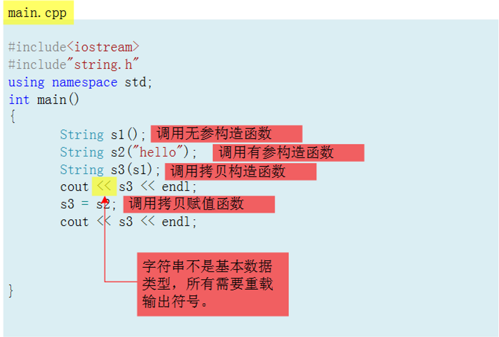
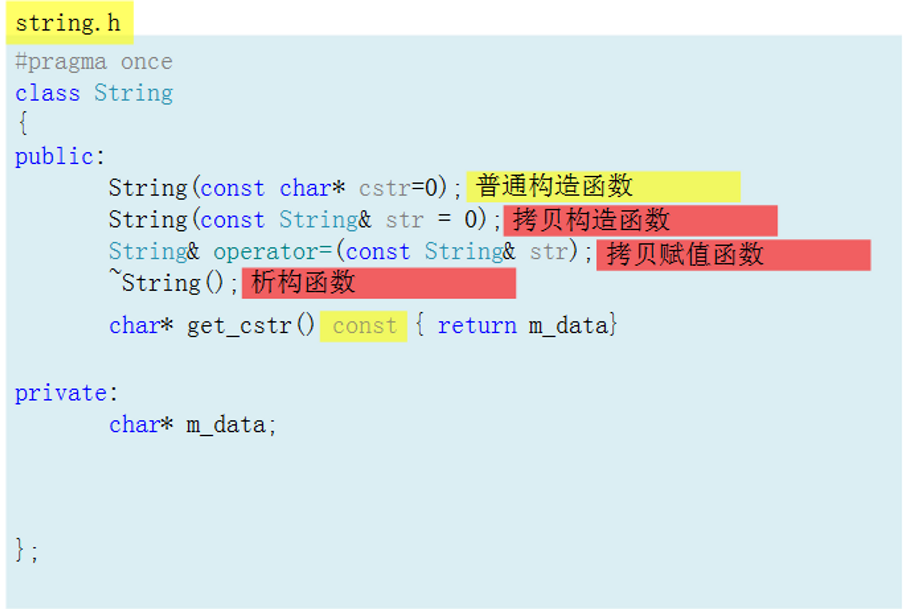
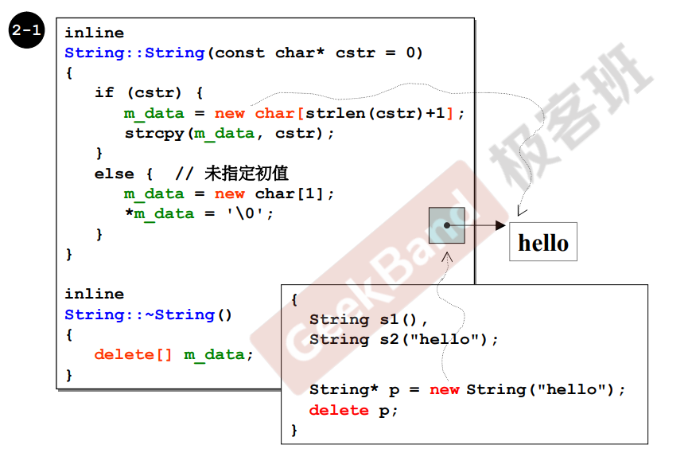
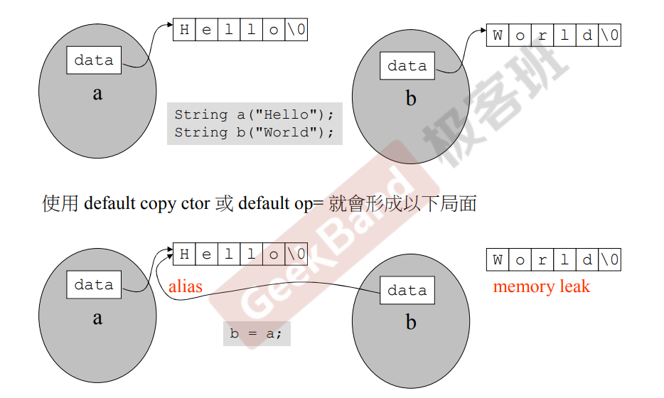
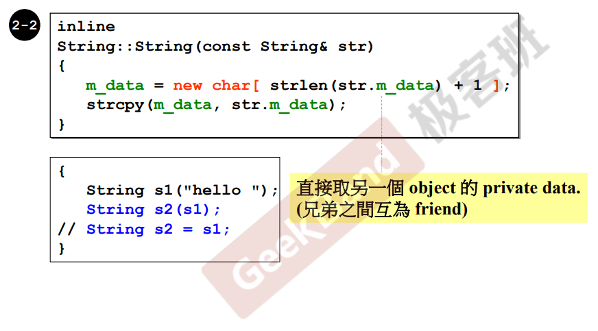
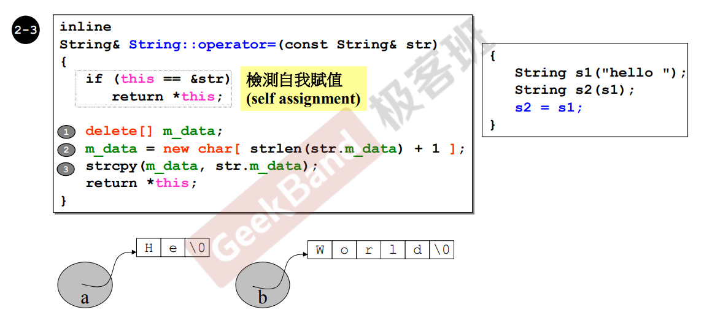
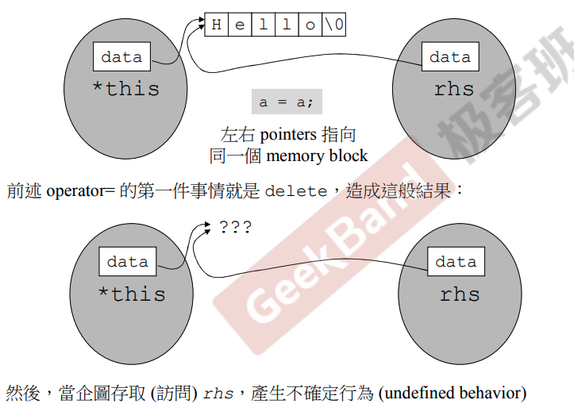
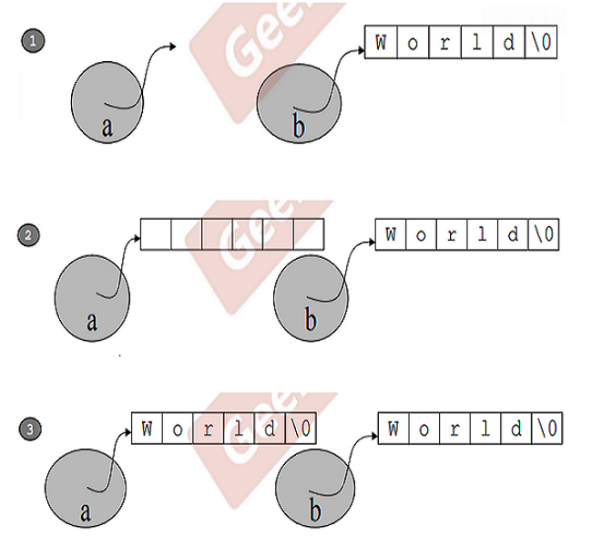

> 类的分类，即类中是否有指针成员；若类中有指针，如果只是简单的拷贝，那就是指针拷贝，两个指针指向的是同一个空间，所以不能直接拷贝。因此，如果类中有指针，一定要自己写拷贝构造。
>
> 以下介绍classes with point members。

# 三大函数



拷贝构造和拷贝赋值，如果没写，编译器会默认写；但是，编译器只是“忠实”逐字节拷贝，导致编译器提供的拷贝赋值只是拷贝了对象的指针，没有真正拷贝对象。



m_data指向字符串，因为不明确字母个数，动态分配；明显不可以用编译器默认的函数。

# 构造函数和析构函数

接受自己类型；是构造函数。析构函数~；死亡时调用。

```cpp
#pragma once
class String
{
public:
    String(const char* cstr=0);
    String(const String& str = 0);
    String& operator=(const String& str);
    ~String();
    char* get_cstr() const { return m_data}

private:
    char* m_data;
};

inline
String::String(const char* cstr=0)
{
		// 首先要创建字符串
		// 检查指针是否是0
    if (cstr)
    {
				// 看存进来多大+1结束符号
        m_data = new char[strlen(cstr) + 1];
				// 拷贝到开辟的空间里
        strcpy(m_data, cstr);
    }
    else
    {
				// 放结束符号
        m_data = new char[1];
        *m_data = '\0';  //这里也许可以这样写：*m_data='';(网友观点)
    }
}

// 对象死亡之前调用
inline
String::~String()
{
		// 释放动态分配的内存
    delete[] m_data;
}
```



> 得到字符串长度的方法：结束符号、前置长度。cpp采用结束符号，在为字符串分配内存的时候，都要多分配一个字节，用来存放结束符'\0'。

检查传进来是否是空值；放置。存在指针，做了动态分配，对象死亡前析构函数必须释放分配的动态内存。s1、s2、p这三个字符串都会调用`String(const char* str = 0)`这个构造函数，离开作用域之后都会调用析构函数；s1和s2离开作用域自动调用析构函数；p是指针，delete释放掉。

# 拷贝构造函数

操作符重载；赋值动作，且参数为自己类型。

## 浅拷贝



classes with point members必须有拷贝构造函数和拷贝赋值操作。以上并不是想要的，希望有相同内容，且操作很危险。首先，b的内存泄露，其次。

这是**浅拷贝**，执行`b=a;`后，本来是想把a的字符串值赋给b，但是这样只会让b指向同一块内存（所包含的内容），还会造成这样一个后果，假如改变a，b也会跟着改变，因为它们指向相同的内容。

此时b叫做a的别名（alias），在编程里面，别名的存在是一件危险的事情。

## 深拷贝



传进来参数，不会去改动，所以用const修饰参数；`String s2(s1)`：以s1为蓝本创建s2；分配空间，把内容拷贝过去。

# 拷贝赋值函数



> 左边清空，创建和右边一样大的空间，拷贝。

> 第2行里面的&代表对象的引用，第4行里面的&代表取地址。

## 检测

```cpp
String s2 = s1;
```

首先检测自我赋值（有可能看起来不像，但是确实是，例如指针名称变动），如果没有检测，会出现不好的结果。

检测：首先对象自己s2是会有this pointer传进来的，str是右边s1传进来内容；看是否相等，自己赋值给自己直接return。

> 不检测自我赋值，不好的结果。
>
> 
>
> 拷贝赋值操作语句：`a=b;`如果指针a和b本来就指向同一块内存空间，杀掉a之后，相当于把b指向的内容也杀掉了，所以没办法做第2步了。

## 赋值



杀掉自己（右边内容）；开辟和赋值过来的对象一样大小的空间；字符串复制（到左边）。