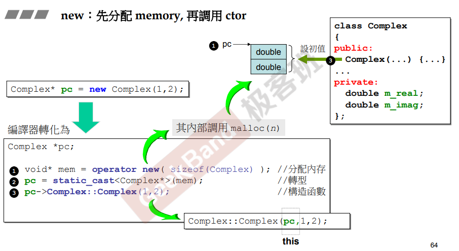
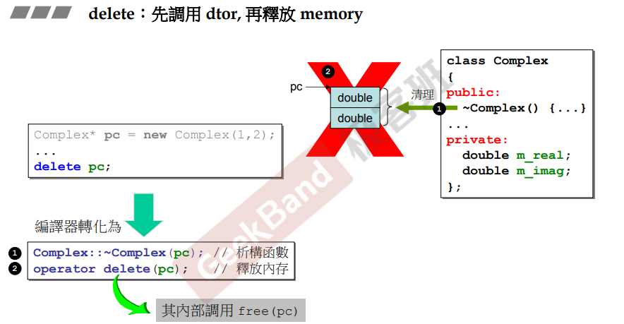
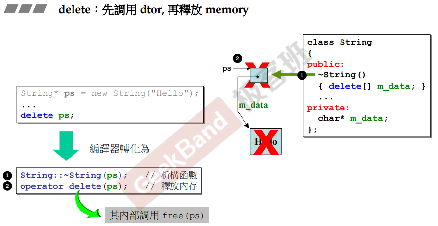
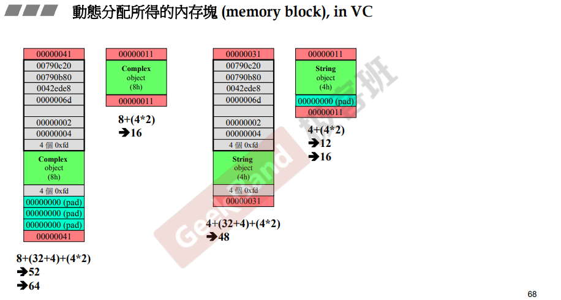
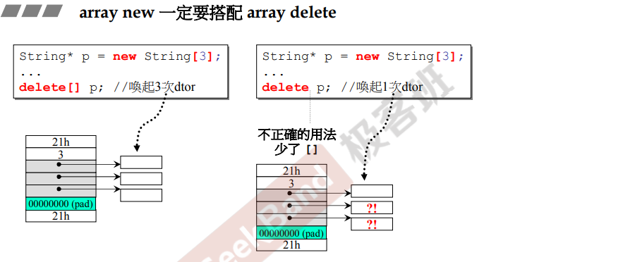
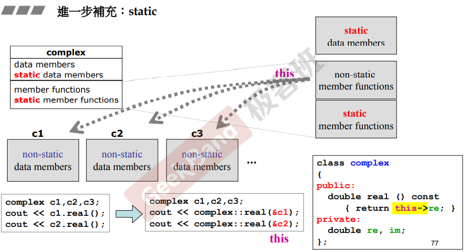
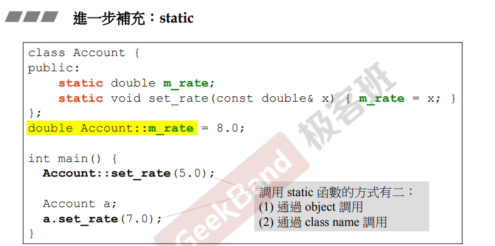
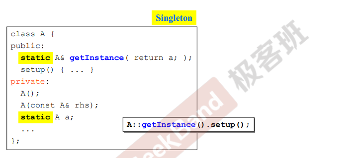
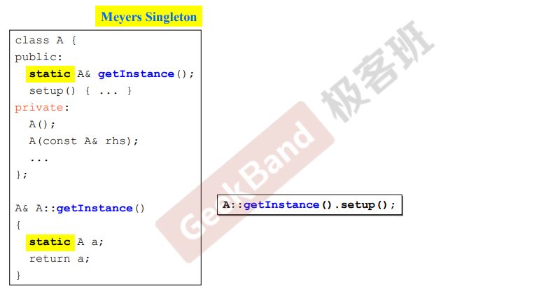

# 栈和堆

## 对象相关

> 局部对象，定义在作用域内的对象，不再单独说明。

### 静态对象

```cpp
{
	static Complex c2(2,3);
}
```

一个对象前面加上static修饰符后，即变成所谓的静态对象（static object），其生命在作用域（scope）结束之后仍然存在，直到整个程序的结束。

### 全局对象

```cpp
class Complex{...};
...
Complex c3(3,4)
{
}
```

定义在任何作用域或者说大括号之外的对象。

> **一个对象的存在和消失取决于构造函数和析构函数何时被调用。**

c3就是所谓的global object，其生命在整个程序结束之后才结束，也可以把它视为一种static object，其作用域是整个程序。

### 区别

对于全局对象，程序一开始，其构造函数就先被执行（比程序进入点更早）；程序即将结束前其析构函数被执行。

对于静态对象，当对象诞生时其构造函数被执行；当程序将结束时其析构函数才被执行，但比全局对象的析构函数早一步执行。

对于局部对象，当对象诞生时，其构造函数被执行；当离开作用域时，其析构函数被执行；对于new出来的局部对象，当对象诞生时其构造函数被执行，析构函数则在对象被delete时执行。

```cpp
class Complex{...};
...
{
	// Complex(3)是该函数体内的临时对象，其所占用的空间从heap中new得到
	// 也就是动态分配得到，p指向这块空间
	Complex* p = new Complex(3);
}
```

> 静态全局对象和一般的全局对象的区别就是一般的全局对象在程序的其他文件中可以通过关键字extern来调用，而static声明的全局变量则只能在本文件中使用。

## 栈空间

**stack，是存在于某作用域（scope）的一块内存空间（memory space）**，例如调用函数，函数本身即会形成一个stack用来放置它所接收的参数，以及返回地址。

在函数本体（function body）内声明的任何变量，其所使用的内存块都取自上述stack。

## 栈对象

> 以下主要说栈对象的生命周期。

栈对象（stack object），其声明在作用域（scope）结束之际结束。这种作用域内的对象（object），又叫做local object，因为它会被自动清理（意思是析构函数被自动调用）。

```cpp
class Complex{...};
...
{
	// c1所占用的空间来自于stack
	Complex c1(1,2);
}
```

举例，当离开作用域{}的时候，c1的生命自然就消失了， 即从栈中获得的内存，离开作用域的时候会自动释放（析构函数被自动调用）。

## 堆空间

Heap，所谓system heap，是指由操作系统提供的一块global内存空间，程序可动态分配（dynamic allocated）从其中获得若干区块（blocks）。new去取，去动态获得，但是同时也要兼任起动态释放的责任。

## 堆对象

当离开作用域{}的时候，动态分配的内存不会消失，即从堆中动态取得的内存不会自动消失，需要手动释放（delete）。

```cpp
// A
class Complex{...};
...
{
	Complex *p = new Complex;
	...
	delete p;
}
// B
class Complex{...};
...
{
	Complex *p = new Complex;
	...
}
```

A：p所指向的便是heap object，因为是动态从操作系统某个地方分配的内存，其生命周期在它被delete之际（此时默认析构函数或者手写析构函数被调用）结束。

B：会出现内存泄露（memory leak），因为当作用域结束后，**p所指向的heap object仍然存在，但是指针p的生命却结束了**，作用域之外再也看不到p，也就没机会delete p。

# new和delete

## new

先分配memory，再调用ctor。



编译器new分解为三个步骤，分配内存→指针转型→调用构造函数。

调用构造函数中，指针来调用成员函数，pc实际上是传入的隐藏参数this，是分配的内存的起始位置，构造函数中进行赋值操作。

## delete

先调用dtor，再释放memory。



class without point members，析构函数不做事情，马上就要delete，清理是做无用功。



class with point members，先调用析构函数，析构函数把字符串里动态分配的内容叉掉，其次释放内存，把字符串（是个指针）本身叉掉delete。

## memory block

即动态分配所得的内存块。


图中为内存结构，在VC中，分配的内存空间大小都是16的倍数，第一个图中是调试模式下，每个格表示4Bytes，Complex对象占8个字节，调试模式占32+4，cookie占4×2，计算得到的结果是52Bytes，不是16的倍数，所以补充12个Bytes的填补字节（pad部分），凑到64。

所以看似得到只是两个double的大小，但是用了64。

> cookie，记录整块给出的大小，系统回收时了解回收多大。

最后一个byte标注是否给出（本来是40→加上标注变为41）：开头和结尾的`00000041`，其中的 `4`是64的16进制，`1`表示这块空间已经给出去了，`0`表示这块空间空闲。

如果没有debug（调试模式），就只有对象大小+cookie大小了：8+（4×2）=16。

## array

当动态分配的是数组。



最后又加了4：因为是数组，要记录这是数组。



> 21h代表一个16进制的数（32+1：已经使用）；3代表新创建了3个字符串。

array new一定要搭配array delete，在使用指针新建字符数组的情况下，在手动释放内存的时候，如果`delete[] p;`写成了`delete p;`会造成内存泄露；因为3次析构函数各自负责把各自分配的动态内存叉掉，没有[]，则只会调用一次析构函数。

值得注意的是，错误用法`delete p;`导致出现的内存泄漏是String类中的指针指向的空间，而非指针本身。

如果是Complex 数组对象，因为其中没有指针，所以就算是使用`delete p;`也是没有问题的。但是为了万无一失，如果使用了array new 一定要搭配 array delete。

# static

包括静态对象和静态函数。



非static函数通过传入的this指针找到要处理的对象。如上所示：c1调用real()；c1的地址即指针就是this pointer，所以c1和c2虽然调用相同函数，但是给到不同数据。

成员函数只有一份，但是需要处理很多对象，所以需要人告诉他处理什么（this），成员函数里需要使用this（黄色），可写可不写。

static函数没有this指针，只能处理静态数据；当数据只需要一份、只能唯一值时，需要定义为静态；静态函数没有this pointer，不可以访问处理多个对象，显然只可以存取处理静态数据。



静态数据需要在类外进行声明；调用静态函数有两种方法，通过对象或者class name调用。

# 单例模式

把构造函数放在private。



有的class只希望产生一个对象；A类对象在private里已经有一个了；且A的构造函数放在private中，外界无法使用。设计静态函数getInstance，使外界可以得到唯一的A；再从这个唯一对象调用类函数。



但是版本1有一个问题，即外界不需要时，A仍然存在；所以把静态自己放在getInstance中，当有人调用getInstance时，才会创建；且有人用后，该对象持续存在。

