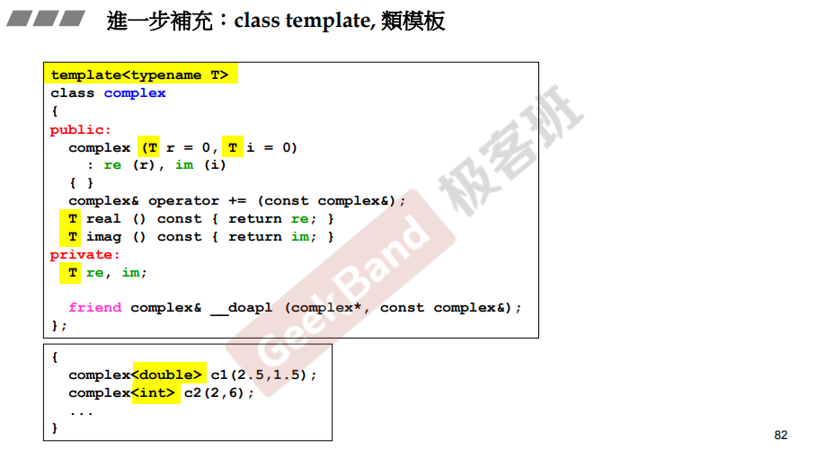
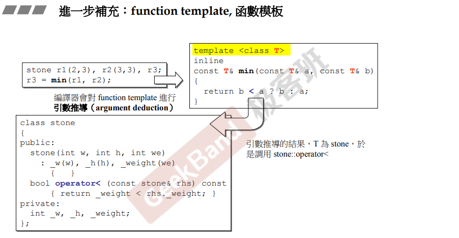
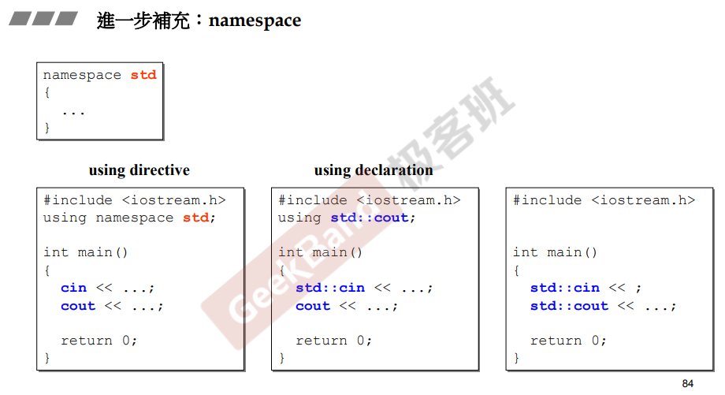

> T：还没有决定是什么；使用时进行绑定；编译器会对代码进行替换。

# 类模板

template和typename都是关键字，`template<typename T>`告诉编译器当前类型还没有绑定；用法：`complex<double>`，编译器会将代码中的 T 替换为double；虽然模板会造成代码膨胀，但这是必须的。、

# 函数模板

此处的`template <class T>` 中的class和typename是一样的；不像类模板必须明确指出T的实际类型。

function template会自动做实参的推导；<操作符重载会自动参考Stone类的方法：有没有定义小于的函数；设计是合理的，比大小必然是<，而具体比较实现则由T类负责，责任分开。

# namespace

所有事物被包括在命名空间内，使不会被同名；标准库所有内容包括在在命名空间std内。

使用方法：`using namespace std;`等同于把封锁全部打开，不用写全名；`using std::cout`一条一条指定声明；全部使用全名。