> Object Oriented Programming
>
> * Inheritance
> * Composition
> * Delegation

# Composition

> has-a.

## 复合关系

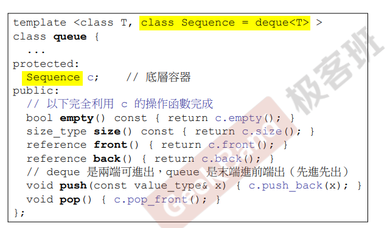

黄色表示这个class queue中，有一个这种sequence类东西；且默认为`deque<T>`类型，即这个sequence是`deque<T>`；从C开始存在这种关系

> 图，黑色菱形，即表示Composition。

deque中可能有很多接口，但是queue只开放这几个，queue的所有功能都是通过deque来完成的，这种模式叫做**Adapter模式**，字如其名，改造适配。

该例子是个特例，并不是所有的Composition都是这样（实现全部挂钩），只要拥有即可；有了`Container`就有`Componenet`，生命是一起的；复合就是一种结构中包含其他类型或者结构。

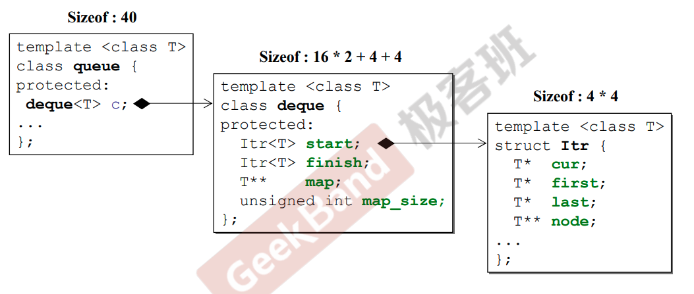

内存角度解释Composition，queue中的 c 所占的空间为40Bytes；后面的图为deque内部以及 Itr 类内部的数据，明白地显示了为什么 c 的大小为 40Bytes。

## 复合关系下的构造和析构

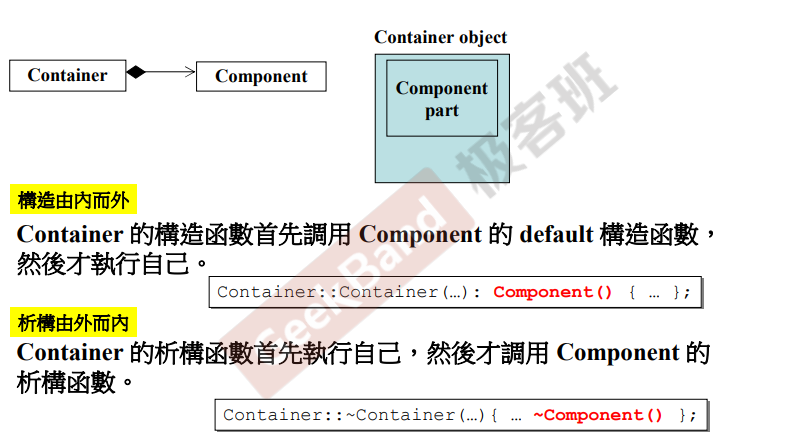

> 构造函数间不可越俎代庖。

左边拥有右边，左边叫做Container，右边叫做Component。

红色的部分是编译器自动加上的，并非程序员写的；可能内部的Component有多个构造函数，但是编译器不知道需要哪个，所以就调用一个默认的构造函数，如果这并不是你期望的，那就需要自己在Comtainer的构造函数的初始列位置写上要调用的构造函数。

> 构造函数总是调用默认的构造函数，如果需要其他构造函数需要自己写、参数。

# Delegation

> Composition by reference.

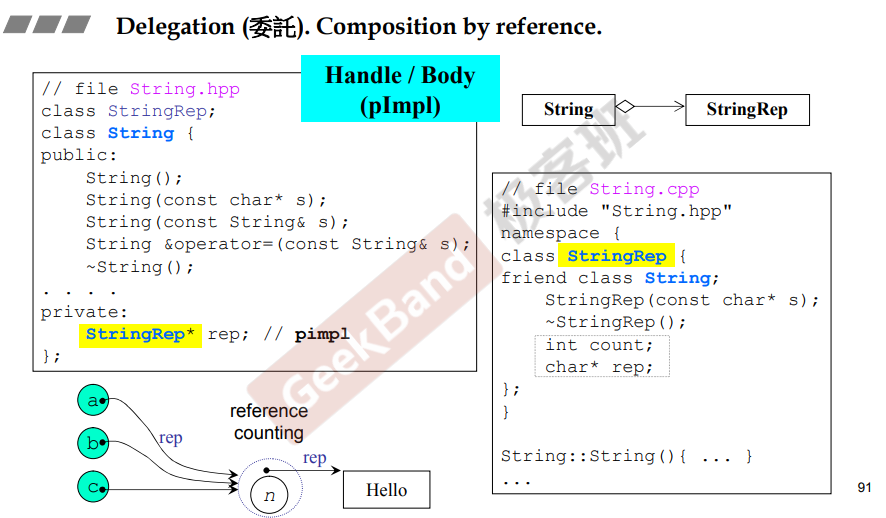

指针rep指向另外一个StringRepclass，左边只是有一个指针指向右边（composition by reference）；Delegation又叫Composition by reference，因为也是拥有，只是拥有的只是个指针；也可以说，两个类之间用指针相连，就叫做 Delegation。

因为需要右边的时候才创建右边，所以左右两边的生命不同步。

String类中的所有操作都是通过rep指针来实现的，这种方式叫做pointer to implementation（pimpl），指针指向实现功能的类；这种设计的好处是，右边无论怎么变化都不影响左边，这种手法又叫做“编译防火墙”。

另一个名称叫做Handle&&Body，左边是Handle，右边是Body；意思是左边只负责对外的接口；而右边负责实现各种功能；之后指针其实可以指向不同的实现类（弹性），客户端可以不受影响且左边可以不用重复编译。

这种做法另一个目的是为了做共享reference counting，三个String对象 a、b和c，都在用字符串"Hello"，三个对象共享 “Hello”，现在 n 是 3。内容一样才能共享。

> 如果 a 想修改字符串的内容，但是不影响 b 和 c，那就拷贝一份让 a 去更改，然后就只剩下 b和 c 共享字符串。这是copy-on-write，就是写的时候copy一份副本让你去写。

# Inheritance

> is a.

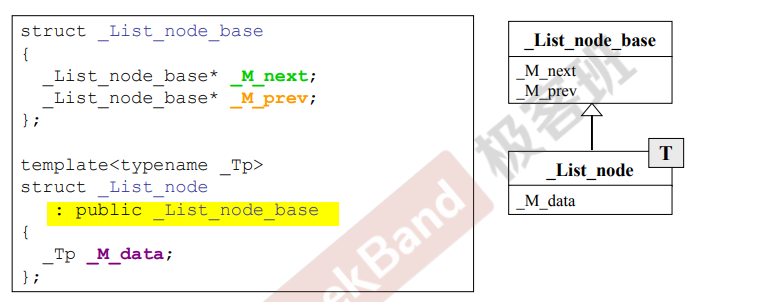

public继承：is a关系；这里只有data，还没有函数，这里子类继承了父类的数据（两个指针）。

## 继承关系下的构造与析构

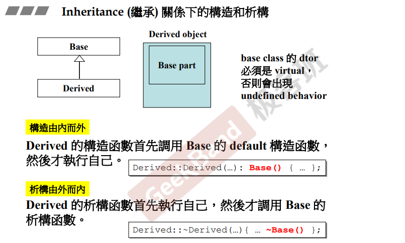

子类的对象中有父类的成分；父类的析构函数必须是virtual的，否则会出现undefined behavior；红色部分是编译器添加的；谁先谁后已经是编译器完成了，程序员不用操心。

## 虚函数

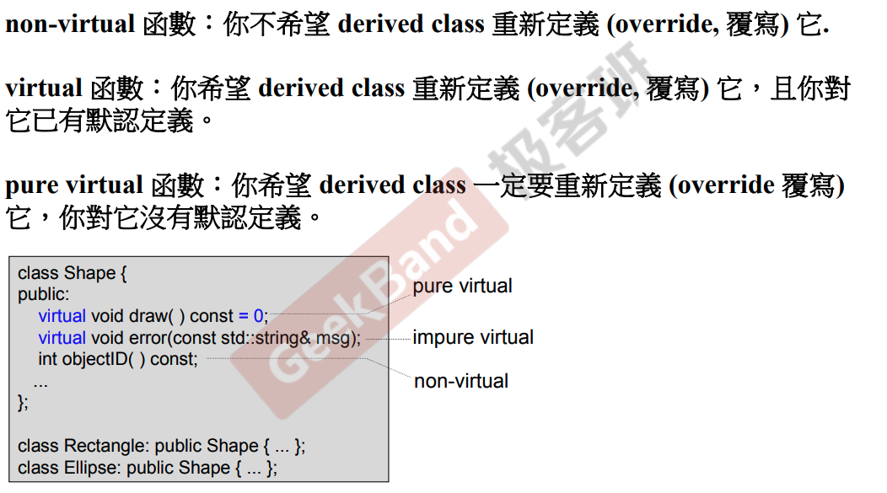

语法，在函数前加上virtual；函数继承，继承的是调用权，子类可以调用父类的函数；子类是否需要重新定义，看virtual类型。

## 虚继承

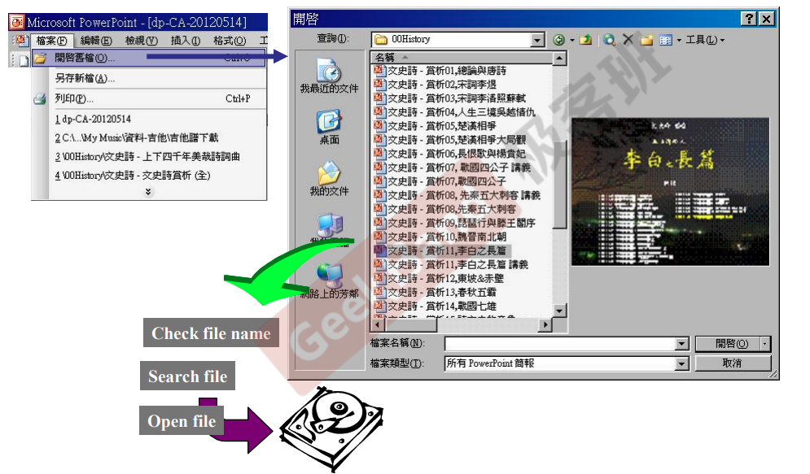

输入文件名称后，按下开始键后，程序会收到一个文件名；程序要检测file name是否正确，是否有不合法字符；到硬盘中查找file是否存在；如果存在，则将该文件打开，并读出来。

### Template Method 

上面的这个流程所有的软件都是一样的，除了最后将文件读出来有所区别；将这个框架写成模板，即CDocument类，其中读内容动作没法做，所以只在父类定义虚函数Serialize，这里可以设计为纯虚函数，也可以设计为默认定义的函数，也可以是空函数。

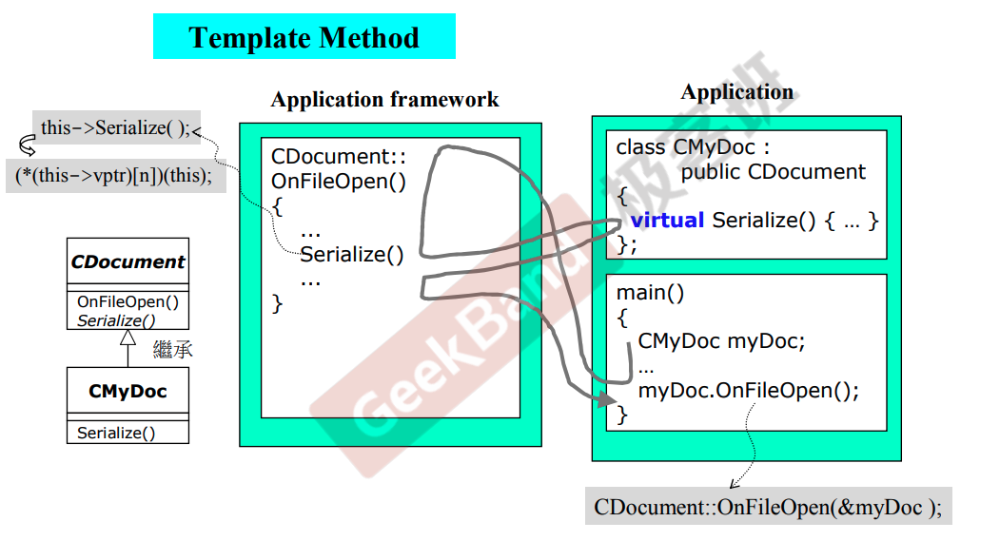

子类对象调用父类函数OnFileOpen()，子类中没有函数OnFileOpen()，myDoc.OnFileOpen()实际调用CDocument::OnFileOpen(&myDoc)，所以才能找到CDocument类中的OnFileOpen函数。

`CDocument::OnFileOpen(&myDoc);`中传入了myDoc的地址，该地址也传入OnFileOpen；调用Serialize的时候，编译器通过this进行调用，即this->Serialize()，而this就是myDoc，也就调用了CMyDoc类的Serialized()函数。

myDoc.OnFileOpen()的执行流程：

1. 调用CDocument的OnFileOpen函数；
2. 在OnFileOpen函数里调用了CMyDoc的Serialize()函数；
3. 执行完了Seriazlize()函数后又回到OnFileOpen()函数中继续执行；
4. OnFileOpen函数执行完毕后，回到main函数中。

过程如图中的灰色线所示。将关键动作Serialize延缓到了子类中执行。将OnFileOpen()这个函数的这种做法叫做**Template Method**模式。

> Java语言中的函数称为Method。

> 框架，将相同功能的确定的写好，留下不能确定的部分设计为虚函数，留给子类实现。

### 代码模拟

模拟该过程的代码。

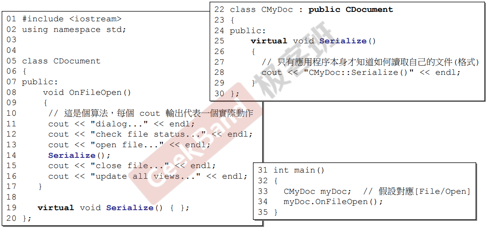

# Inheritance + Composition

## 构造与析构

两种情况：Derived继承Base后，复合Component；Derived继承，复合Component的Base。

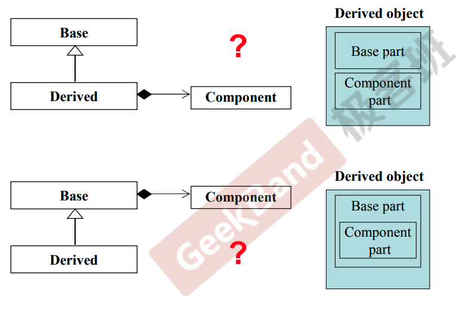

> 第二种比较好想，Componet→Base→Derived，析构Derived→Base→Componet。

第一种以重要性记忆，Base在前，先构造后析构。

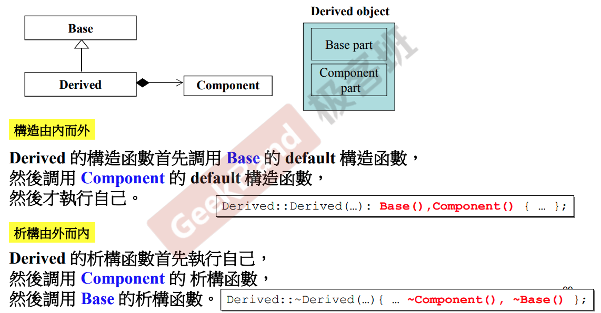

# Delegation + Inheritance

## Observer

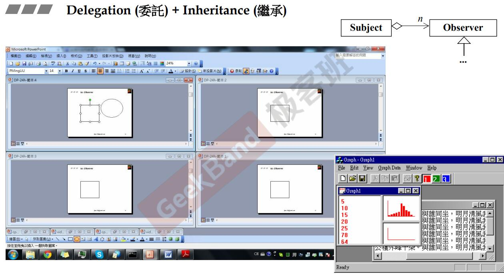

Document，多开窗口，打开同一文件；或者对于一个数据，多种View查看；要求数据变化，则多窗口下或者多视角下，同时发生变化。

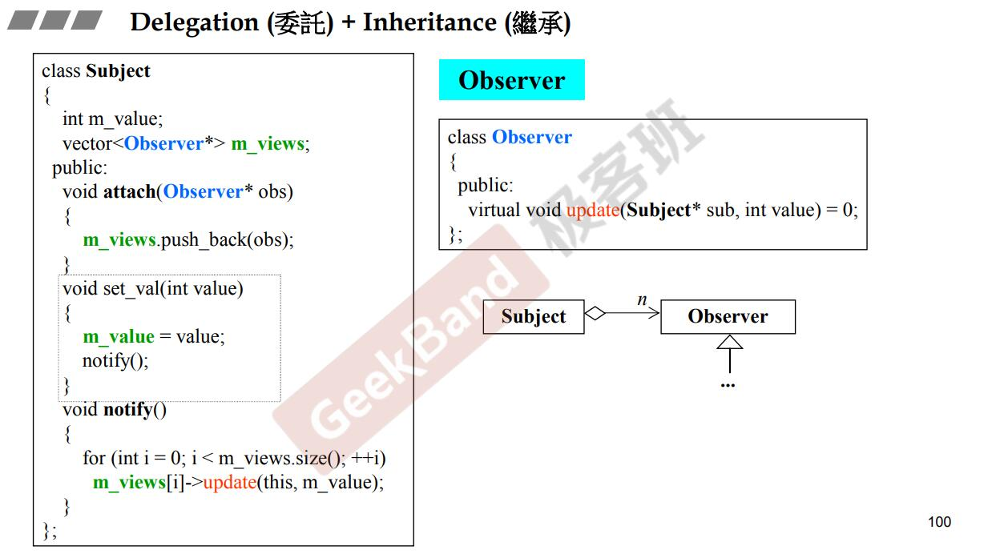

抽象出Observer，且使使用者Subject可以拥有多个Observer；Subject vector容器放指向Observer的指针，注意到Observer可被继承，即可以派生出多种功能的Observer，均可被放在Subject容器中。

Subject提供注册、注销、遍历通知的功能；遍历通知，遍历调用update即可。

> 这就是OOP。

## Composite

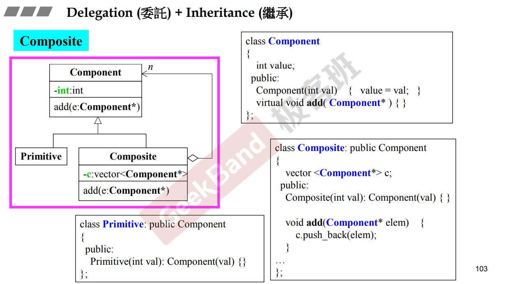

希望写一个目录系统；Primitive代表文件，Composite代表文件夹，可以容纳多个文件，但同时也可以容纳文件夹；对于Component设计为，Primitive-is a-Component，Composite-is a-Component；于是，Composite不写死为放Primitive或者Composite（都可以放），而是放Component。

> 以上，都是放指针，不额外说明。

> add设计同理，加文件和文件夹都可以；add不可以设置为纯虚函数，Primitive无法做add的动作。

## Prototype

希望树状继承体系，可以创建未来才会出现的子类；设计一个框架，客户买后，才会派生子类；无法new，因为不知道类名，希望派生类有原型，框架看到后作为蓝本，进而创建。

原型，子类中安排一个静态对象，类型为class自己；每个子类将原型登记到框架端，则框架相对的需要准备空间；子类构造函数设为私有，自己创建一份，可以调用，构造函数内的addPrototype将指针放到prototypes里；子类设计clone，可以new自己，框架端通过原型调用clone函数，没有原型则无法调用；设想clone可以设置为静态函数，使框架直接调用，问题在于静态函数调用需要classname，而框架不知道类名。

子类有一些负担，私有构造函数等，但为了和框架搭配，是值得的。

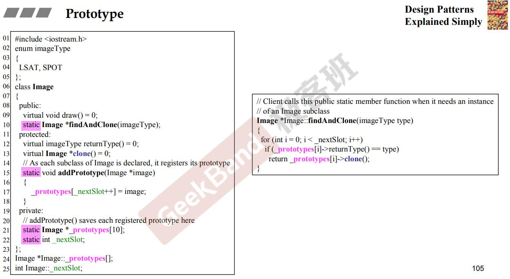

clone纯虚函数，要求子类必须给出，容器数组放原型。class里静态的data必须在类外做定义（给内存）。findAddClone让框架端在容器里找原型（实际可能是靠名称找），找到之后调用该原型的clone。

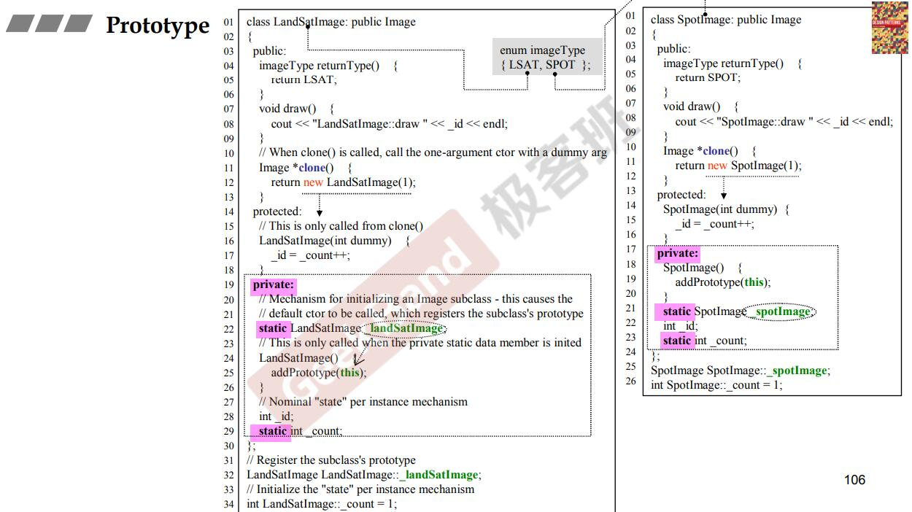

clone实现，总是new自己；原型，静态自己，创建在私有区域，创建出来时候调用构造函数，这里把自己放在框架容器内；两个构造函数，即#带参构造函数有什么用，框架利用原型clone时，需要new，这里使用的构造函数，不能再把对象放上去，因为框架容器只放原型，于是再写#带参构造函数，同时该构造函数仍然不打算让外界创建，希望让原型使用，所以private或者protected，又希望其和初始构造函数区别，带一个参数，但实际上完全没有使用。
