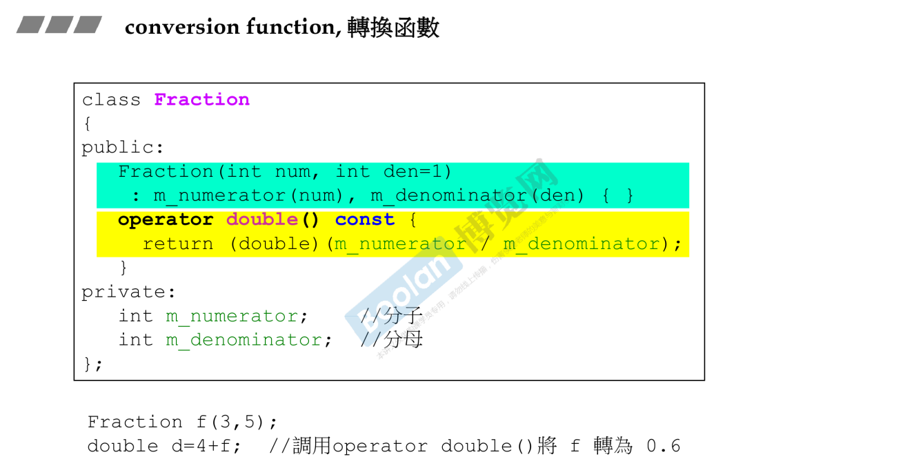
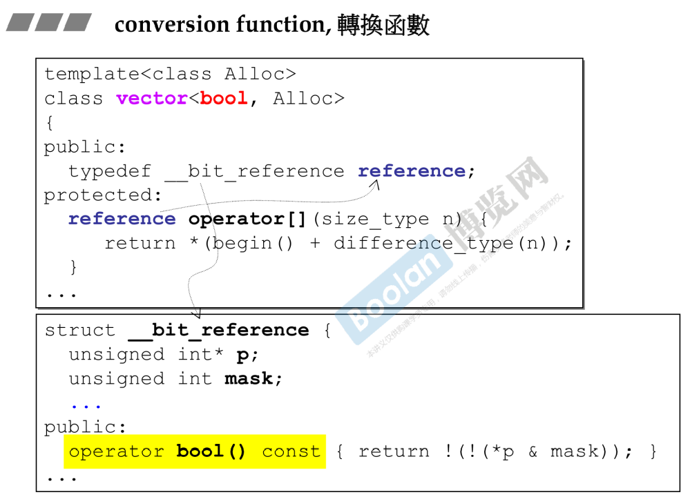
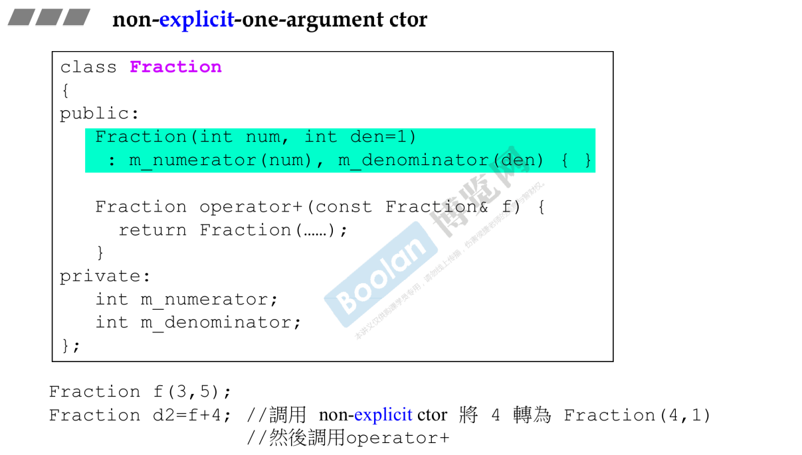
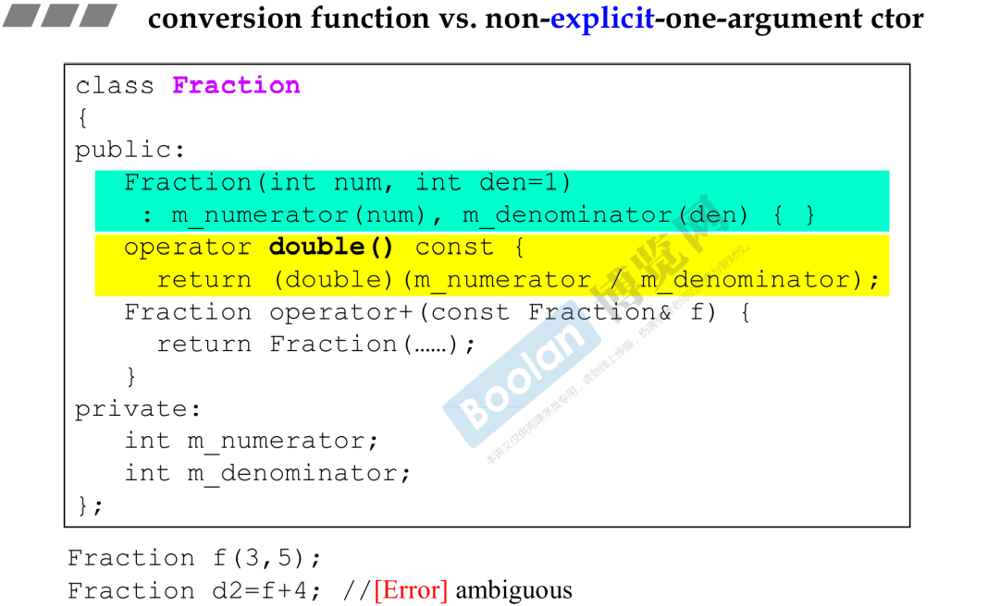
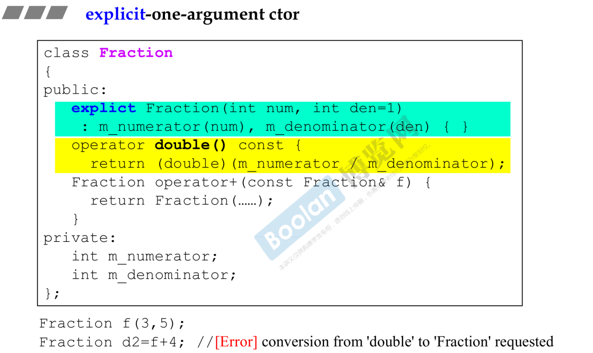

# 转换函数

转换函数是类成员函数，用来将对象类型转换为其他类型。

## 语法

```cpp
/*
 * type 要转换成的类型
 * const 转换函数只是转换对象类型，并不会（也不应该）改变对象内的任何成员，设为const
 * {} 没有参数，转换不需要参数
 * @return 没有返回类型，返回类型就是转换成的类型
*/
operator type() const {}
```

## 示例



如果后面场合有把Fraction当作double使用，编译器会认为很合理（实际上认为也是合理的，才会这么做）；调用（黄色部分）即可；return type不用给出， 默认由名称里的类型给定。

> 转换函数通常是const的，因为并不会改变数据。

> Q：编译器如何编译`double d = 4 + f;`？
>
> A：首先找有没有全局的`operator+(type, Fraction)`函数，找到则编译通过（type 为整型或浮点型都可以）；如果走不通，则看`f`能否转成整型或浮点型（类中是否有相应的conversion function），可以则编译通过。

> 只要认为合理，也可以给出转换成其他类型的转换函数。

## 标准库用到转换函数的地方



> bool模板偏特化。

`operator[]`对中括号做重载，取出第100个位置bool值，传回来bool，却传回蓝色的类型reference。

> 设计模式：Proxy。

合乎想像的是，蓝色类型reference果然有向bool转换的转换函数。

# 转换构造函数

non-explicit-one-argument constructor；没有explicit的可单传入实参构造函数。one-argument，只需要一个实参（其实是可以多parameter的，其他参数给出默认值即可）；non-explicit，构造函数没有加关键字explicit。

## 转换功能

和上述转换函数方向相反；（没有explicit的可单传入实参构造函数）可以用于把double转换为Fraction类型。



> Q：编译器如何编译`d2 = f + 4;`？
>
> 编译器找到Fraction重载的`operator+`函数，发现函数参数为Fraction，于是看看4可不可以转成Fraction（隐式转换），由于Fraction有一个non-explicit-one-argument constructor，因此转换成功，该行编译成功。

## 特殊情况

当转换函数和无explicit的可单传入实参构造函数同时出现。



> Q：是否可以编译通过？
>
> 不可以！两条路径可行，所以编译器不知道走哪条路径。

## explicit



explicit的可单传入实参构造函数；explicit告诉编译器不可以把3自动变为（隐式转换为）1/3；该构造函数只能以构造函数的形式调用；这里4无法转换，报错转换失败。

> explicit只有用在构造函数前面。Cpp面向对象高级编程（下）-学习笔记（一）转换函数.md