# Components

> STL是GP最成功的作品，深入STL即是深入探索泛型编程。

C++ Standard Library；注意命名空间，所有组件封装于std，所以常常把std命名空间全部打开，也可以部分打开。

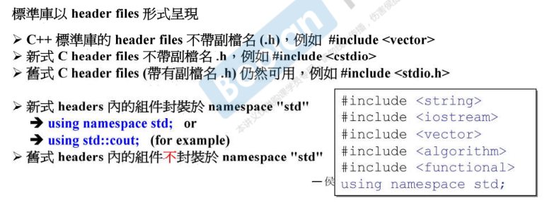

Standard Template Library，占据C++ Standard Library约70%，分为六大组件。

> C++不同编译器、开发工具下，标准库一样。

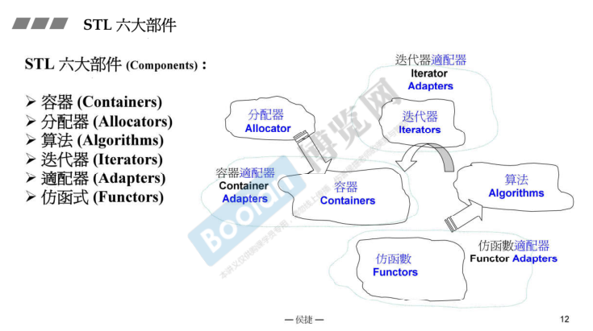

容器帮忙解决内存的问题，其背后需要分配器支持；对容器的操作，有些操作容器本身做，更多独立为模板函数，变成Algorithms。

> 数据在容器里，而操作数据的函数却在算法里，即不在其本身class中，基本思想就和OO不一致。

算法希望处理容器的数据，迭代器作为桥梁，迭代器是泛化的指针。仿函数，作用是一个函数。Adapter帮助转换，对容器、仿函数、迭代器做转换。

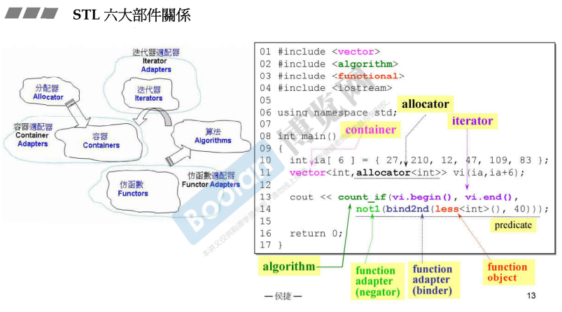

vector第二个参数可以不写，即选择默认分配器，allocator本身也是模板，分配的是int；count_if计算符合当前条件的元素有几个；头尾得到两个iterator；仿函数less用来比大小，但是需要拿每个元素和40比，使用bind2nd，即绑定第二参数；not1，则从<40变为>=40。

> 容器的选择，取决于数据的分布程度和操作类型。

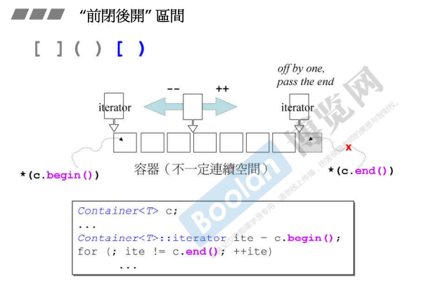

所有容器表示头和尾，begin指向第一个元素，end指向最后一个元素的下一个位置，因此是前闭后开空间。for loop格式如上。习惯写法。

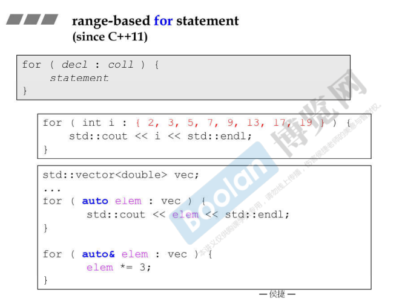

现在这样for range了；auto后的elem其实就是iterator；auto可以自行推导，但是不是万能的，尽量还是明晰变量类型；加上引用，可以更改原元素。

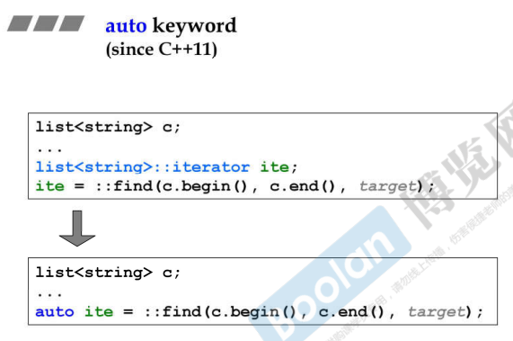

auto可以自行推导。

# Containers

> Program = Data Structures + Algorithm.

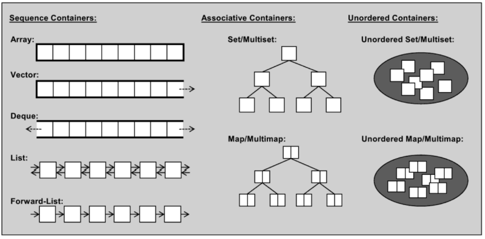

容器大致分为Sequence Container、Associative Container、Unordered Containers（C++ 11新出现）；但不是好分法，Unordered Containers实际上也是Associative Container，底层是HashTable。

标准库提供的链表实际上是双向链表。

红黑树，高度平衡二分树；set、map基本都使用红黑树来做；set、map不同只在于key、key-value；multi则代表key可重复。

## helper

```cpp
class container_helper {
public:
    container_helper(){};
    // 成员函数
    long get_a_target_long();
    string get_a_target_string();

    static int compareLongs(const void *a, const void *b);
    static int compareStrings(const void *a, const void *b);
};

// 从console中读入一个 long
long container_helper::get_a_target_long() {
    long target = 0;

    cout << "target (0~" << RAND_MAX << "): ";
    cin >> target;
    return target;
}

// 从console中读入一个 string
string container_helper::get_a_target_string() {
    long target = 0;
    char buf[10];

    cout << "target (0~" << RAND_MAX << "): ";
    cin >> target;
    snprintf(buf, 10, "%d", target);
    return string(buf);
}

// 比较 long
int container_helper::compareLongs(const void *a, const void *b) {
    return (*(long *)a - *(long *)b);
}

// 比较 string
int container_helper::compareStrings(const void *a, const void *b) {
    if (*(string *)a > *(string *)b)
        return 1;
    else if (*(string *)a < *(string *)b)
        return -1;
    else
        return 0;
}
```

## array

C++11中将数组抽象成了一个模板类array。

```cpp
// 必须要告诉多大
array<long, ASIZE> c;
```

```cpp
c.size();
c.front();
c.back();
c.data(); // 返回指向数组第一个元素的指针
```

```cpp
// 最后一个参数告诉怎么比
std::qsort(c.data(), ASIZE, sizeof(long), container_helper::compareLongs);
long *pItem = (long *)::bsearch(&target, (c.data()), ASIZE, sizeof(long),
```

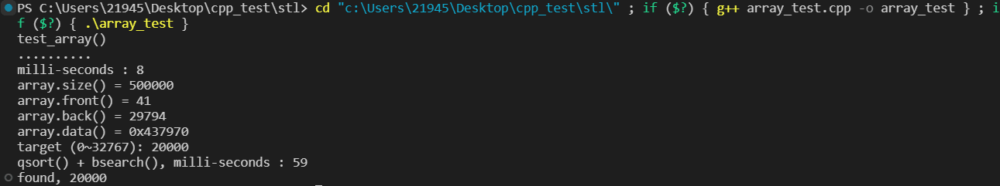

## vector

> 测试程序希望在单独的空间（namespace）里。

vector的底层是一段连续的内存空间，当容器满时进行扩容，将容器大小扩容为原来的两倍，即“两倍增长”。容易知道，capacity必定大于size。

try catch来应对内存不够的情况，尤其在元素数量是输入的情况下。

::find是一个模板函数，属于“算法”，这是全局的。

> auto来简写iterator类型；找到了，解参考取值。

```cpp
vector<string> c;
c.push_back();
```

```cpp
c.size();
c.front();
c.back();
c.data();
c.capacity();
```

```cpp
auto pItem = find(c.begin(), c.end(), target);
```

```cpp
sort(c.begin(), c.end());
string *pItem =
            (string *)::bsearch(&target, (c.data()), c.size(), sizeof(string),
                                helper.compareStrings);
```

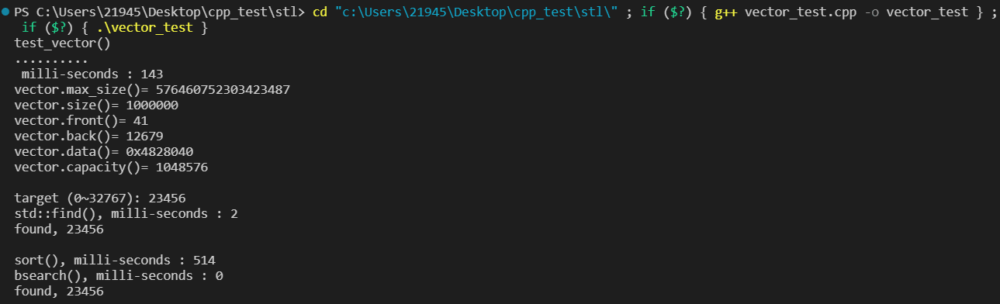

## list

双向链表；第二个参数总是使用默认的分配器；vector的成长总是缓慢的，因为它在扩容后，还有拷贝的过程；list则是一个萝卜一个坑。

```cpp
c.sort();
```

sort是算法的一个；但是这里没有呼叫全局sort，这里调用的是list类成员函数sort；对于该容器，容器本身实现的sort的性能一般比标准库中的算法sort更好。

> forward_list是C++11标准引入的，其前身是gcc中的slist；是单向链表。

## deque

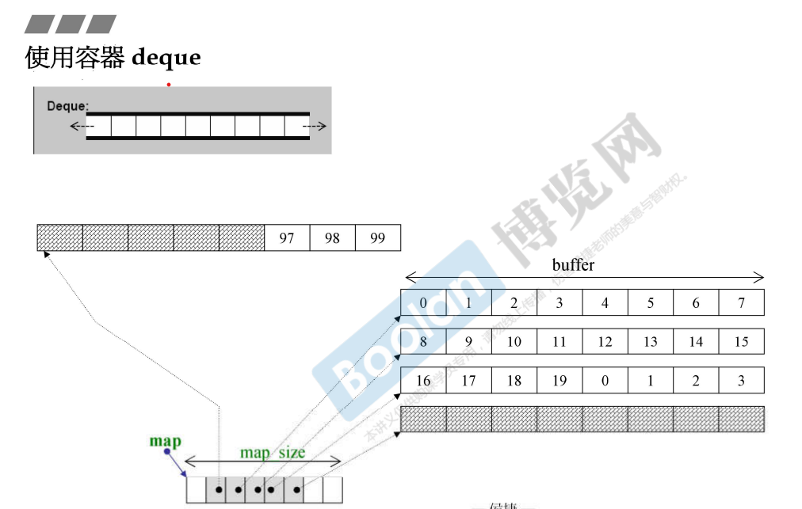

deque双端插入和删除；但是其底层是**分段连续**的，只是对于使用者来说造成了一种连续的假象。

> ++进行操作符重载，来进行段间跨越。

两端开口，如果容量不够用，则继续分配buffer，并有指针指向纪录；每次扩充多少，有关于效率问题；vector的“两倍增长”已经是权衡后的方案，但仍然会有浪费；然而总有tradeoff，空间利用率高了，时间上就会下滑。

```cpp
sort(c.begin(), c.end());
```

> deque没有sort()，使用全局即可。

## stack & queue

底层都是通过deque实现；从设计模式上说，这两种容器本质上是deque的适配器。

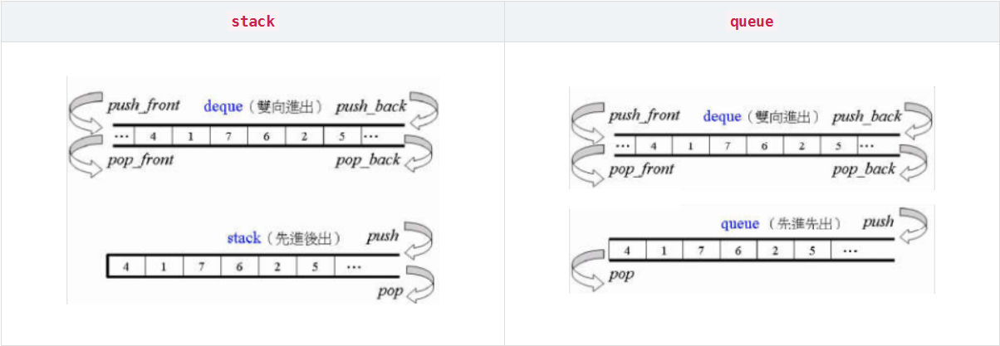

```cpp
// stack
c.push();
c.pop();
c.size();
c.top();
```

```cpp
// queue
c.push();
c.pop();
c.size();
c.front();
c.back();
```

## multiset & multimap

> 以上介绍的都是Sequence Containers，而以下都是Associated Containers，可以理解为小型的“关联数据库”，查找非常快。

> stack和queue不会提供iterator，否则会破坏其结构上的特性。

底层是使用红黑树实现的。树本身遵守一定规则，所以只能insert。

> multiset允许重复元素，因此重复的也放入，size等同于insert的数量。

```cpp
c.insert(string(buf));
```

```cpp
auto pItem = find(c.begin(), c.end(), target);
auto pItem = c.find(target); // 快很多
```

对于放进去的时间复杂度没有要求，着重于查找要快，则考虑multiset & multimap。

```cpp
c.insert(pair<long, string>(i, buf));
```

```cpp
auto pItem = c.find(target);
```

**因为multimap支持重复的key，因此不能使用重载的`[]`运算符进行插入**。

## unordered_multiset & unordered_multimap

底层使用哈希表实现。bucket一定比元素多，单bucket的链表不可以太长；当元素数量大于bucket，bucket就要扩充，而元素打散重新挂。

```
c.bucket_count()
c.max_bucket_count()
```

后面会涉及load_factor。

```
c.load_factor()
c.max_load_factor()
```

## set & map

不允许重复元素，碰到重复则不放。

值得注意的是，map允许`[]`赋值了，内部自动组装为pair。由于key没有重复，map全部放入了，1000000。

```cpp
c[i] = string(buf);
```

# Allocator

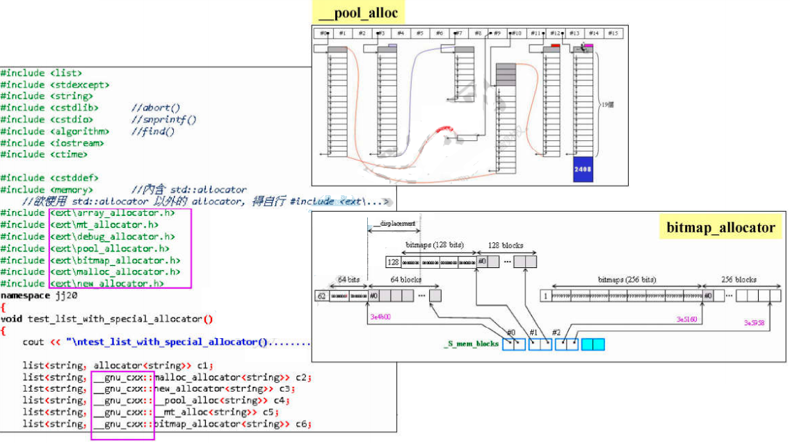

gcc额外定义的分配器均位于`__gnu_cxx`命名空间下。

```cpp
#include <memory>    // 內含 std::allocator
// 欲使用 std::allocator 以外的 allocator,得自行 #include <ext\...>
#ifdef __GNUC__

#include <ext\array_allocator.h>
#include <ext\mt_allocator.h>
#include <ext\debug_allocator.h>
#include <ext\pool_allocator.h>
#include <ext\bitmap_allocator.h>
#include <ext\malloc_allocator.h>
#include <ext\new_allocator.h>

#endif
```

list举例使用分配器，list给出不同分配器作为参数，push_back时则自然会使分配器工作。

> 分配器常常作为第二参数。

分配器一般用于构建容器，不会直接使用。因为分配器想要直接使用也不好用，使用free关键字时不需要指定回收内存的大小，**而分配器的deallocate函数需要指定回收内存大小**。

```cpp
int *p;
allocator<int> alloc1;
p = alloc1.allocate(1);
alloc1.deallocate(p, 1);
```

