# Design Patterns

Object-Oriented Programming和Generic Programming是STL容器设计中使用的两种设计模式。

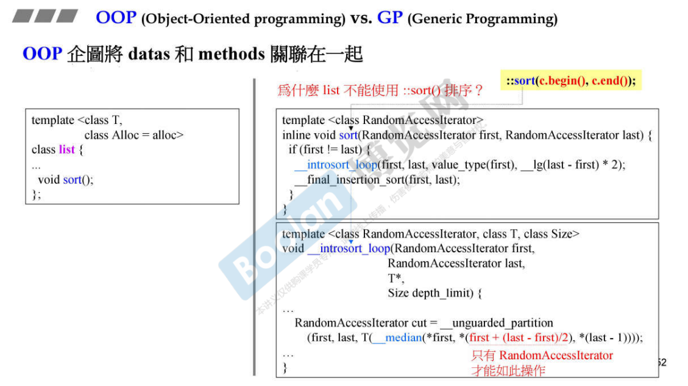

OOP的目的是将**数据**和**方法**绑定在一起，例如对list容器进行排序使用list的sort方法，sort已经放在list里了。

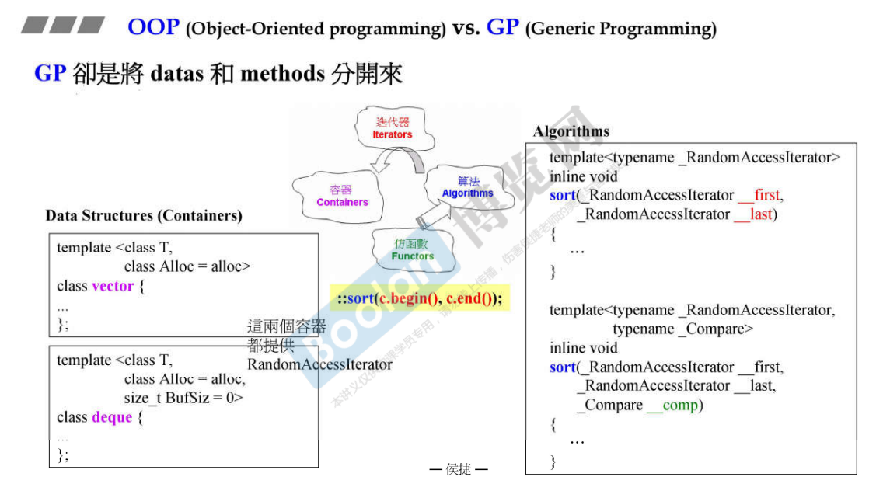

GP的目的是将**数据**和**方法**分离开来，例如对vector容器进行排序使用std::sort方法，sort被设计在Algorithms里了，则这里全局的设计，使用Iterator得到范围，`sort(c.begin(), c.end());`。

> 标准库没有太涉及OOP，没有复杂的继承关系。

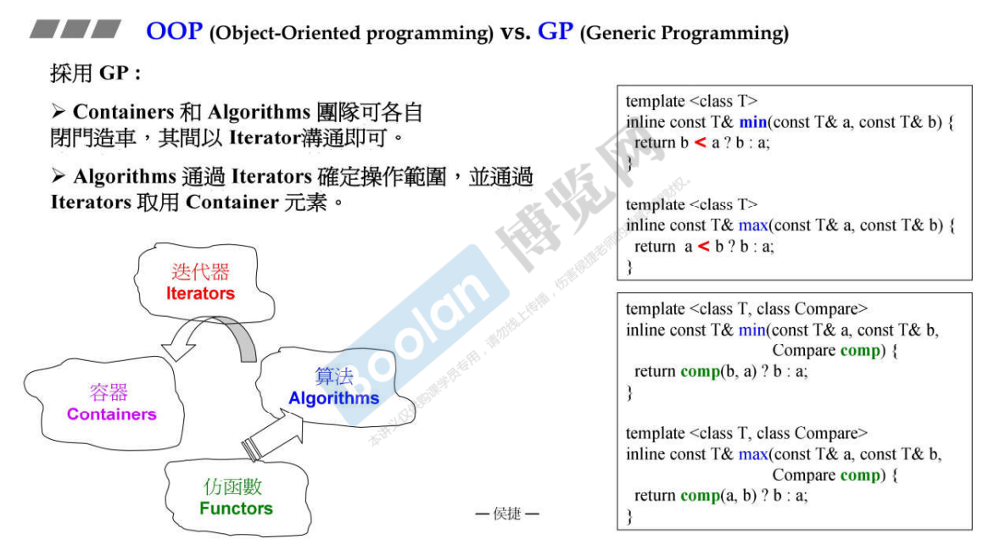

举例，min和max，闭门造车，<的事情，min并不关心，而由T自己决定（操作符重载）。

**Q：list为什么不能使用全局设计？**


全局sort调用的_introsort_loop，其中迭代器进行了+-/，传进来的迭代器必须是Random的，而List的迭代器是不能跳来跳去的，只能++，所以List不能使用全局设计。 

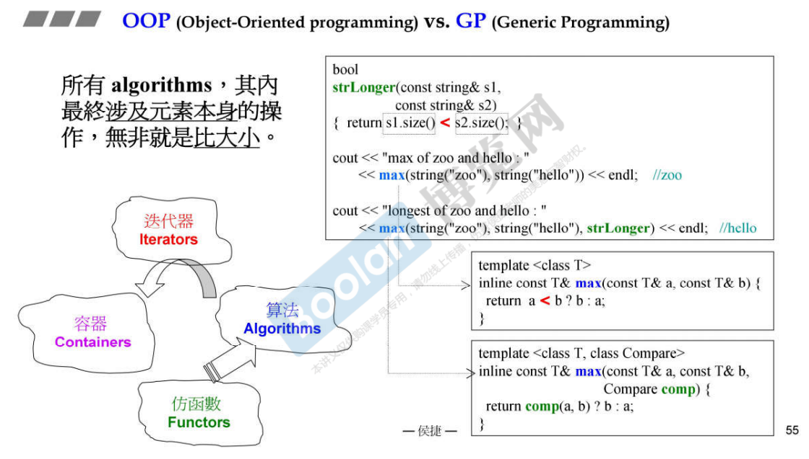

max有两个版本，对于第一个版本，字符串有字典形式的比大小，string的比大小使用该默认版本；第二个版本，其中第三个参数接收一个Compare，在这里自定义比大小的方式，比的是size。

# Operator Overloading & Specialization

## operator overloading

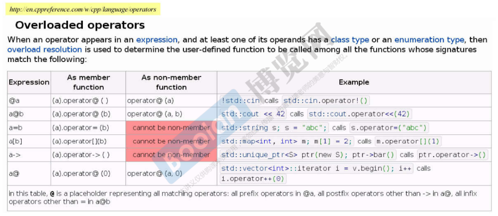

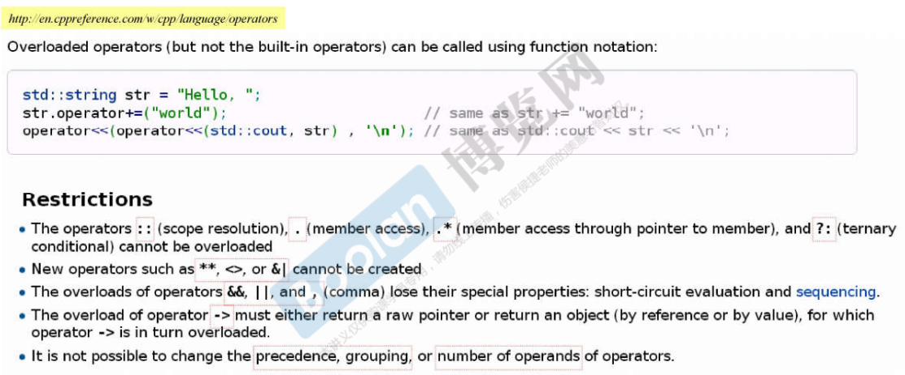

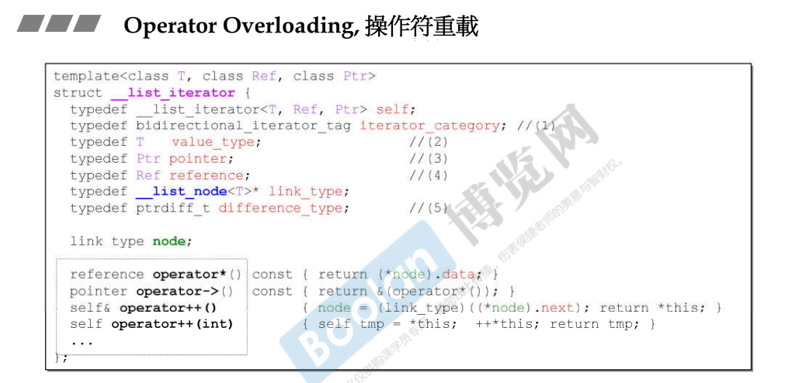

一定会重载对指针定义的所有动作，以上列出来了4个，但仍有很多。

## template

* 类模板
* 函数模板
* 成员模板

## specialization

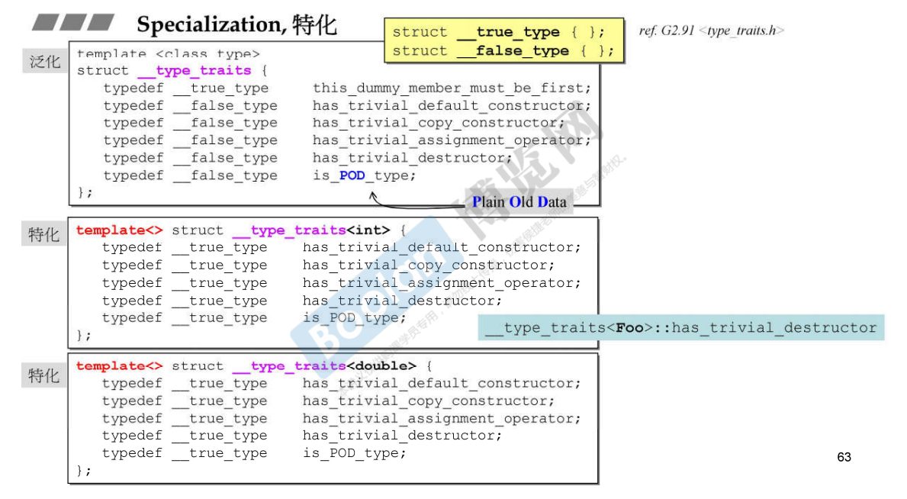

设计类模板，有一个泛化版本了；但对于独特type，有一个更好的处理方法，则可以使用Specialization。

以上例子仅仅用来演示Specialization语法；分别指定int和double时的特定语法；template后面的<>变为空。

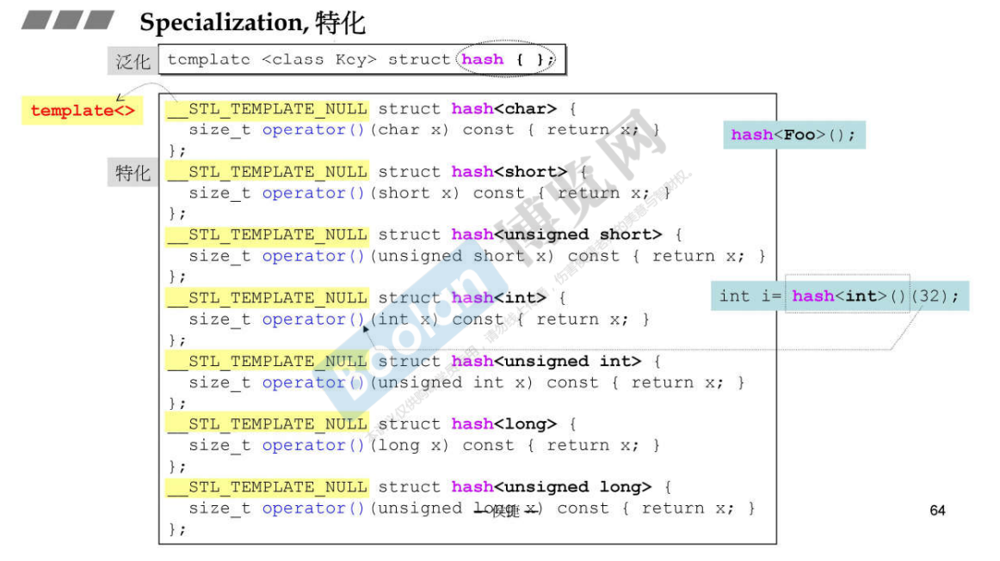

_STL_TEMPLATE_NULL实际上就是template<>，hash这个类模板在以下传入类型时，特化。

> 以上是全特化Full。

## partial specialization

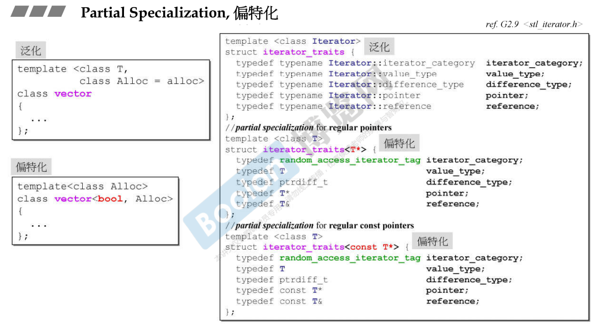

左边，两个模板参数，绑定了一个模板参数；指定接受参数为bool，有特化实现，bool容易想到是更精简的空间。

右边，范围偏特化，泛化接收任意type，而如果绑定的是指针，则有偏特化实现，如果绑定的是const pointer，也有偏特化实现。

# Allocator

## operator new & malloc

allocator，幕后英雄，不需要直接使用，但是优劣很重要，影响到容器效率。

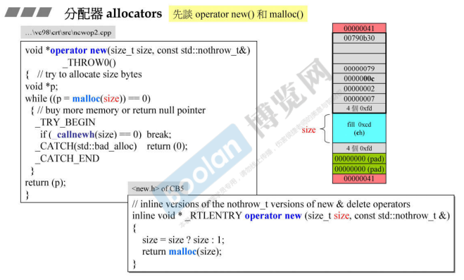

new到operator new，再到malloc，malloc属于C runtime Lib；下面再调用不同操作系统的底层API，几乎所有C++平台都是这样。

malloc分配的内存，只有蓝色部分是想要的，malloc会分配更多的，**内存管理**详细讲。

## allocate

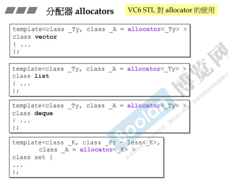

分配器对malloc的使用，VC6下；默认使用的是紫色，是一个模板。

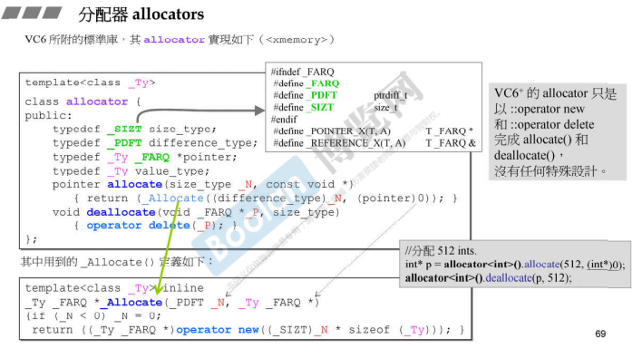

VC下，allocate其实就是operator new；deallocate其实就是operator delete。

> 如上所示，没有**特殊设计**。

> 也因此，如果像之前alloc放100万元素，每个元素附加内容很多，整个看，甚至比100万元素本身空间开销大。

```cpp
int *p = allocator<int>().allocate(512, (int*)0);
// 必须要记住要的内存多大，但是实际上没人记得
allocator<int>().deallocate(p, 512);
```

> typename()就是临时对象。

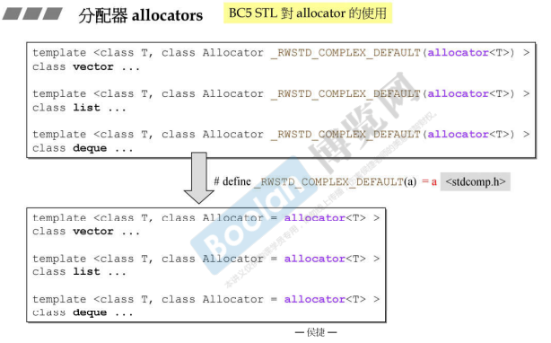

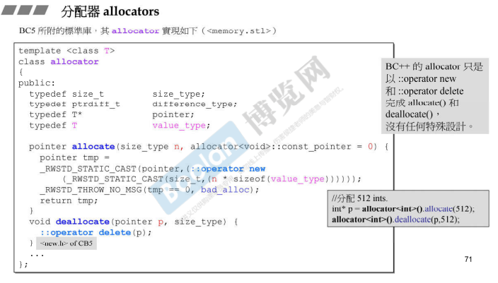

BC5下，allocate还是operator new；deallocate还是operator delete。

> 也没有特殊设计。

## GCC2.9 & alloc

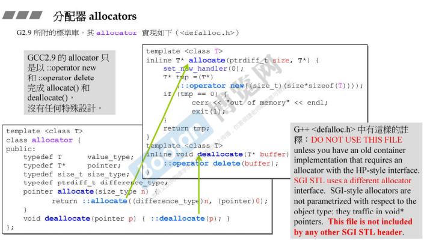

GCC同上，没有特殊设计；回到malloc，可以想到，确实会带来额外开销，因为日常拿到的通常小，**即这里的额外“大”是一个比例上的问题**。

> GCC说明了，SGI STL使用了另一个allocator。

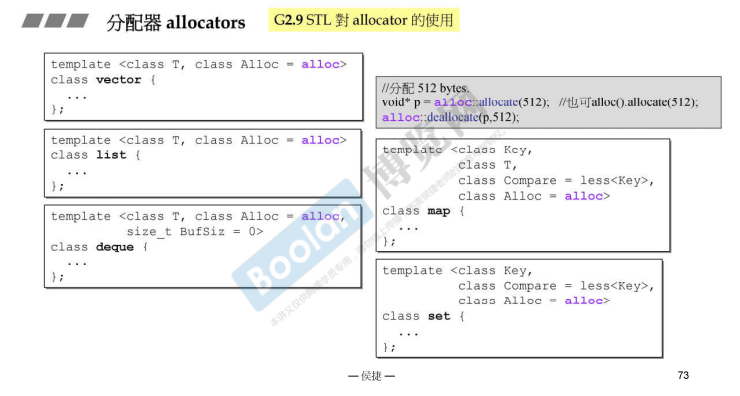

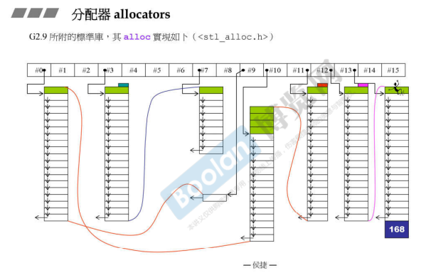

因为原先设计确实很烂，不如直接malloc；alloc希望好。

alloc呈现出来的行为分析如上；主要诉求是，减少malloc次数，额外开销主要集中在cookie，用来记大小，free时好办。

事实是容器元素大小一样，cookie用处就不大了，没有必要。于是GCC的alloc，设计16条链表，每条链表穿起8bit、16、32、...的内存块；容器大小总会调整到8的倍数；如果没有了，alloc去申请后分割；cookie就被舍弃了。

> 因此，一个粗略估计，对于100万个对象，可以省掉800万字节的cookie。但是每次去拿大块，还是会有额外资源，不过肯定不大了。

> alloc仍有缺陷，但是影响不大。

## GCC4.9 & _pool_alloc

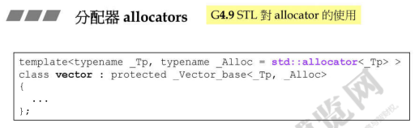

4.9并没有沿用alloc，而是到了std::allocator。

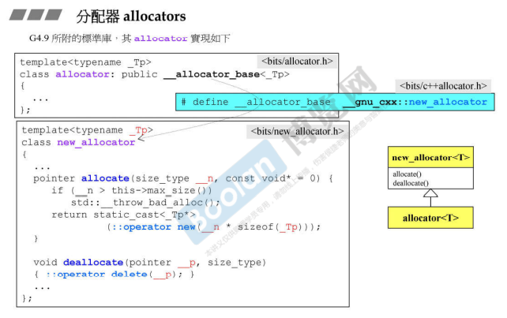

可以看到allocator父类是new_allocator；可以看到new_allocator还是operator new、operator delete；4.9又回到了VCBC情况。

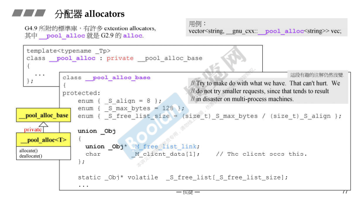

但是alloc还在，已经知道STL有很多扩充的alloc，其中_pool_alloc就是刚刚讨论的alloc。

> 因为关键点一致，常量8，最大bytes128，free_list也还在。

如果希望使用还是可以用。

```cpp
vector<string, _gnu_cxx::_pool_alloc<string>> vector;
```

# Containers

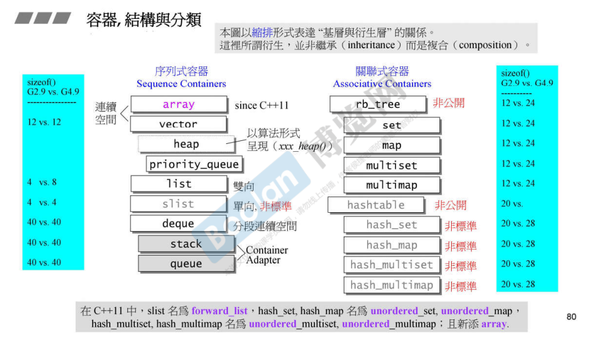

> 注意这里的Classes是composition。

> 题外话，A需要用到B里的方法，可以使用继承或者复合。

注意sizeof和元素、元素大小、元素个数都没有关系，指的是容器控制所需的大小。

# List

## GCC2.9

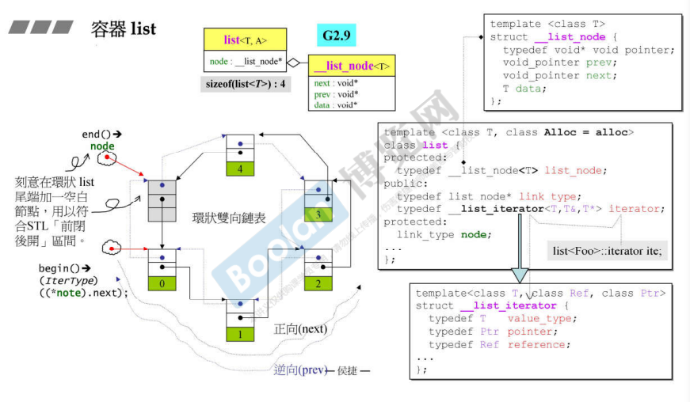

node是link_type，是一个指针指向list_node，则必定是4个字节。所以G2.9下，4个字节。

list_node是真正的节点，数据、向前指针、向后指针。

指针类型为void* ，但是这样可以运作，但是不够好，程序的设计中仍然要转型；G4.9有改善。

> 所以list的分配器要内存时，其实是以list_node为单位的。

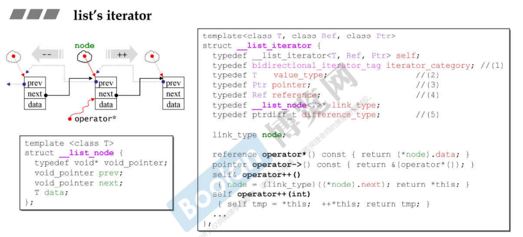

iterator不能是指针，++操作是错的；++操作应该这样实现，iterator要进去list_node看next。

所以iterator这里做成Class，基本所有容器都有typedef iterator。如上所示，list里iterator三个模板参数，可以预见，iterator内有大量操作符重载；几乎所有容器的iterator都要做如上5个typedef。

## Iterator in ++

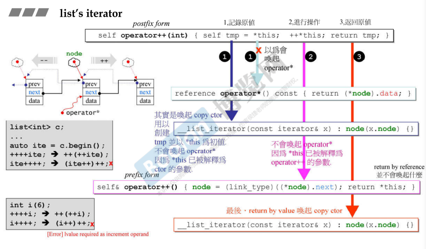

++的例子，动作很少，注意操作符已经被重载了，不能使用以往经验挪用；使前++无参数，而后++有参数（这个参数实际上没有意义），以此来区分前后++，这里涉及到操作符重载的知识。

前++直观；后++实际上调用了前++，后++首先，这里从右向左看，首先是拷贝构造，*this被解释为参数，然后调用前++。

注意前++和后++的返回类型，实际上是向整数看齐，整数什么行为，这里就是什么行为，看左下角，不允许连续两次后++，而允许连续两次前++，容易知道，返回类型设置的理由了。

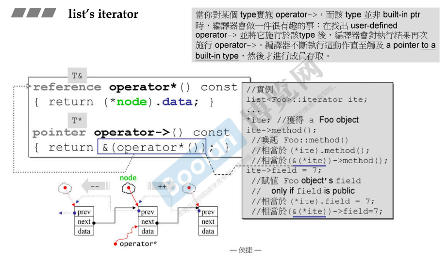

## GCC4.9

> 2.9种，void* 和 T T& T* 传入参数令人疑惑，应该有更好的写法。

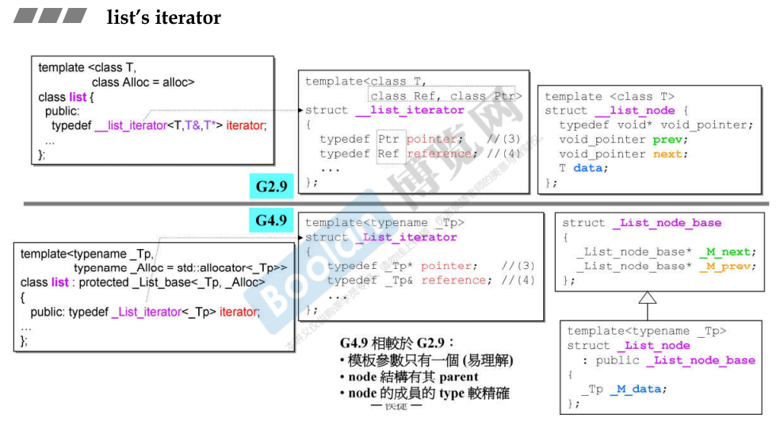

4.9改为只传入T，而在iterator内取引用和指针做typedef；指针应当pointer to 自己，也修正了。

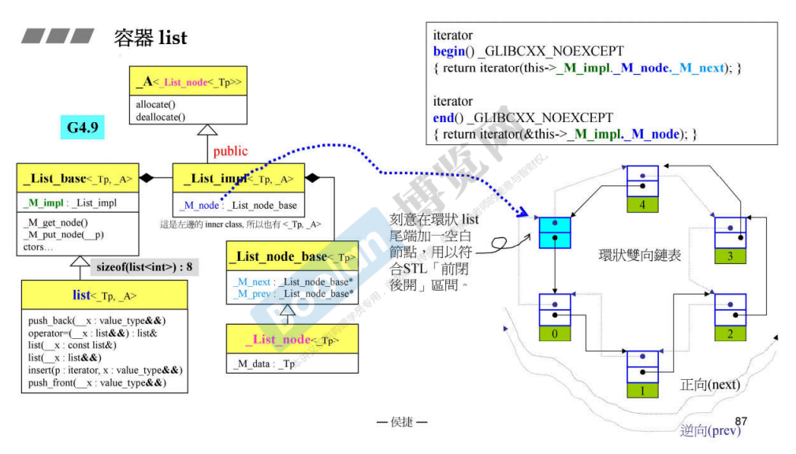

但是4.9中，Classes中复杂了，猜测也有设计的合理性。

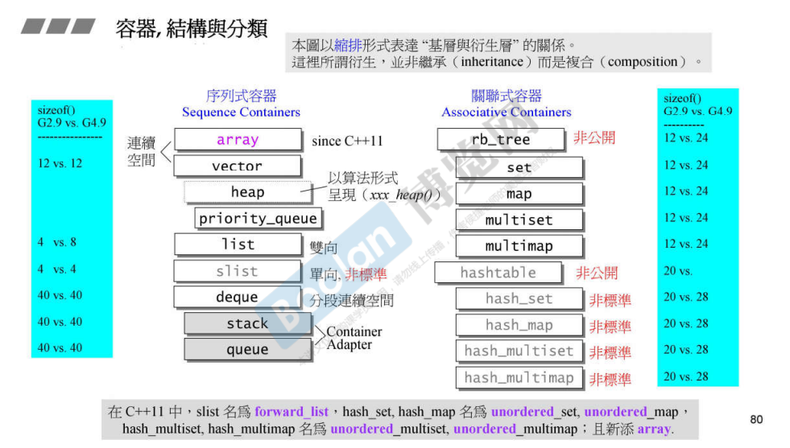

除此之外，需要注意到4.9中，size变成8了，可以通过Classes看出来是两个指针，而2.9只是一个指针指向。

## Iterator & end()


需要一个空白节点，来做前闭后开区间；最后一个元素的下一个元素不属于这个List，几乎所有容器都提供begin()和end()，而end()就指向空白节点。

# Iterator Traits

## Iterator rotate()

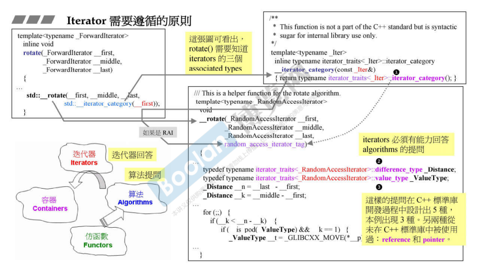

算法和容器之间的桥梁，算法通过Iterator知道范围，而在这其中，算法需要知道Iterator的特性。rotate中，可以看到有调用iterator_traits，想要去得到category，category指的是iterator的分类，分类和iterator的性质有关，rotate需要知道是什么分类。

difference_type表示两个Iterator间的距离可以用什么表示。value_type表示Iterator指向元素的类型。可以看到，算法要求知道以上三个信息，而Iterator来回答。

## Associated Types

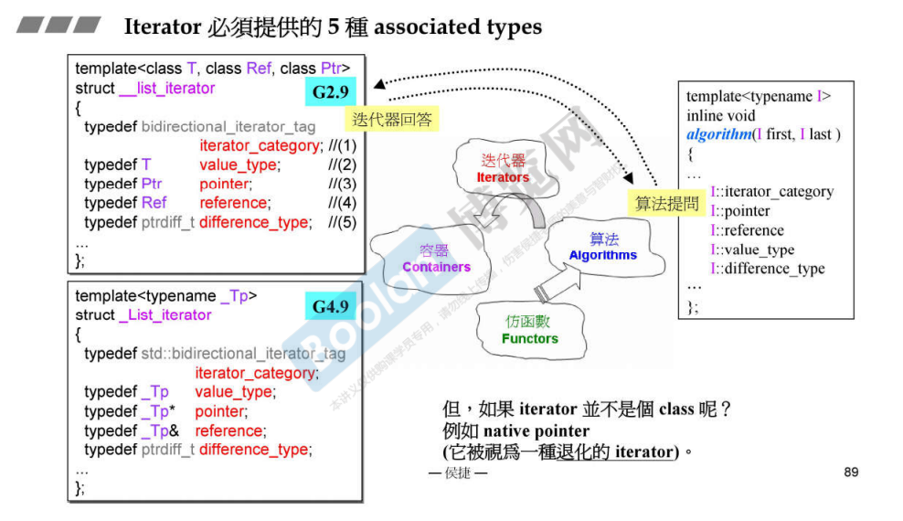

其实在链表里就提到以上五种typedef，算法提问，迭代器回答即可。

> 很明显，STL list认为以ptrdiff_t作为difference_type就足够了，当放得更多，就crash了。

> 以bidirectional_iterator_tag来表示双向链表。

而Traits作为人为设计的机制，起什么作用呢？

因为只有class可以做typedef，而常常纯进去的是指针，而不是迭代器。

> 指针就是退化的Iterator。

## Iterator Traits

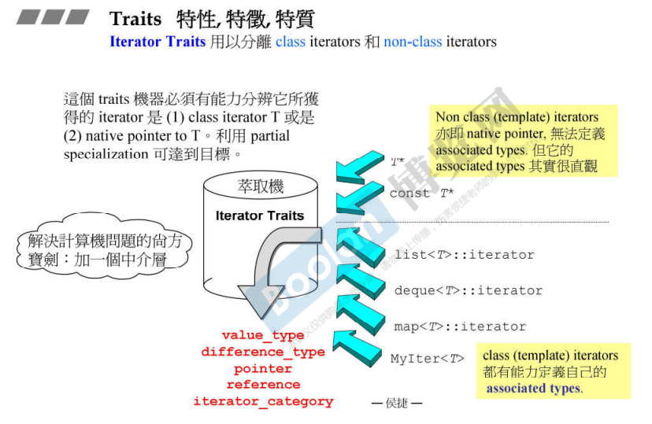

class直接问，而指针由另外一种方式得到；于是加上中间层，萃取机，这是一种silver bullet。

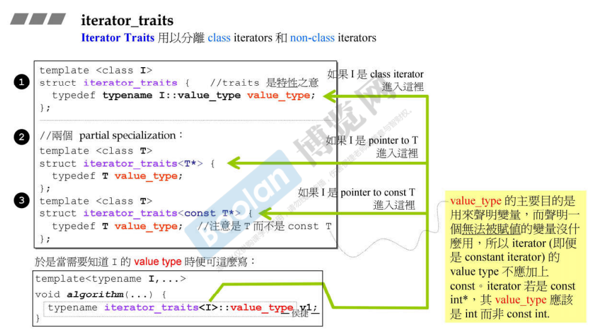

算法需要5种I的相关信息，最下面，算法需要知道value_type，但是不知道是不是Class，所以放到Traits中再问，进行间接问答；利用偏特化，传入指针，如果Traits直接代替指针来回答，既然传入的是T的指针，那type就是T啊。

> 为什么不是const T？从value_type的使用目的考虑。

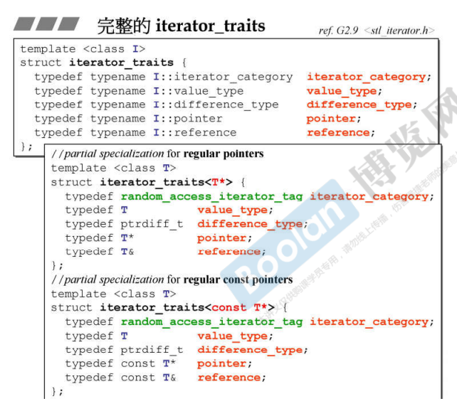

重新来看其他4个查询项，random_access明显对应于指针，绿色的东西后面会说；很明显，Traits代替了指针来回答。

> ptrdiff_t是固定的difference type。

各式各样的Traits


# Vector

## Reallocation

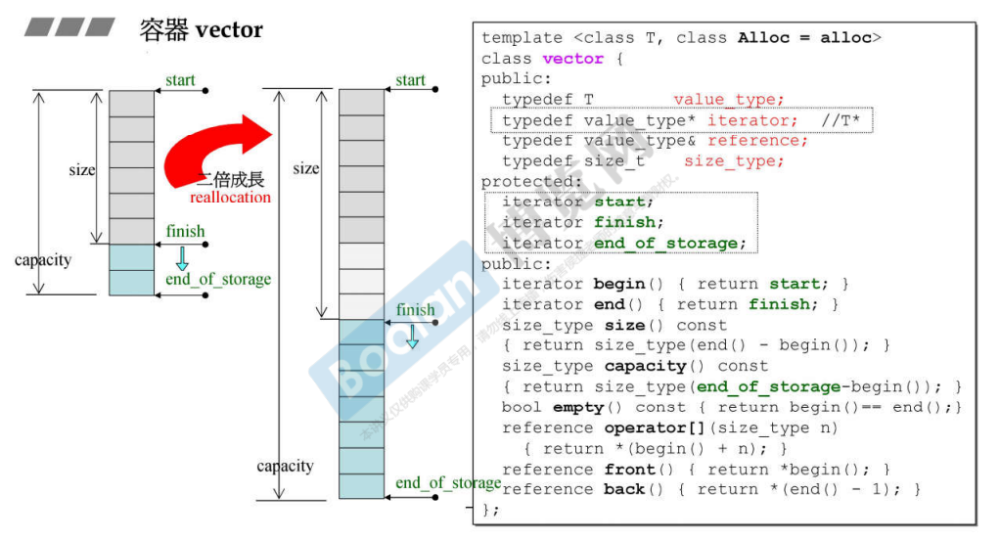

三个指针控制整个容器，sizeof自然大小只是这三个指针。

> 基本所有库，都是两倍增长。

> 连续空间或者号称连续空间，都会重载[]。


> 重复做检测，因为aux函数也会被其他函数调用，可能另外的调用没有做检查。

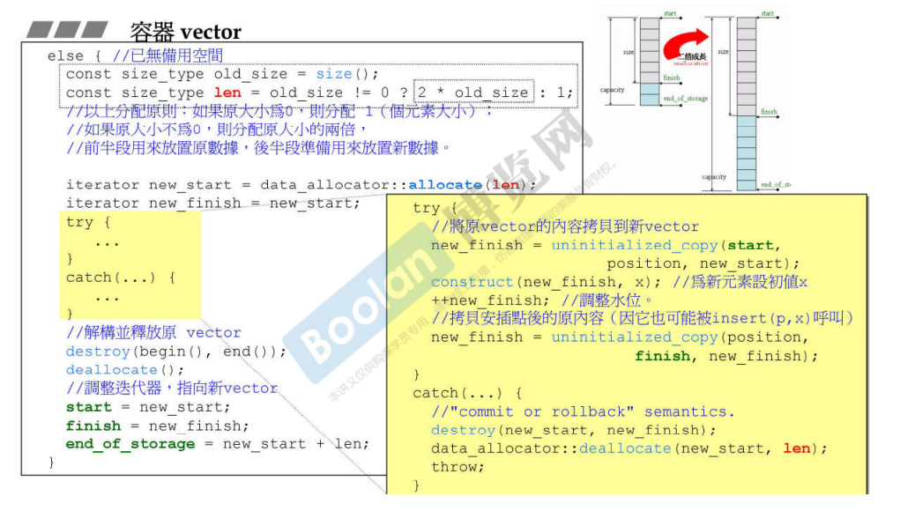

push_back自然只是拷贝原内容，结尾放上新内容，但是其他调用aux，可能是在中间插入。

**每次增长，都会大量调用构造析构！**

## Iterator

### G2.9

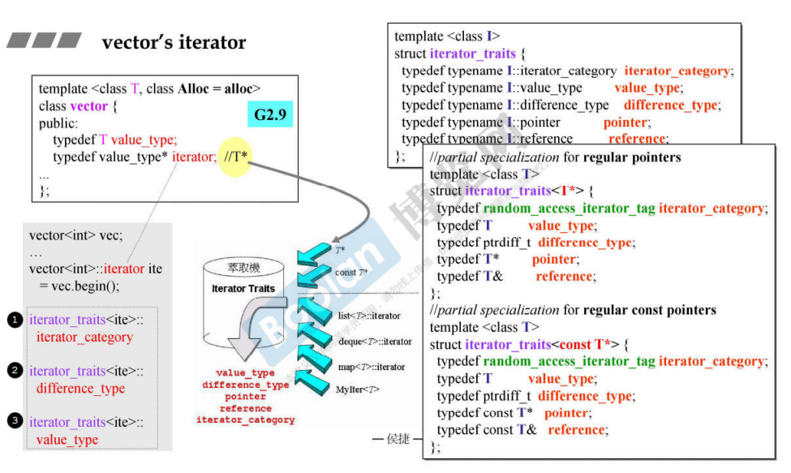

实际上就是指针。

问5个相关类型，指针丢到Traits，进入偏特化处理。

### G4.9

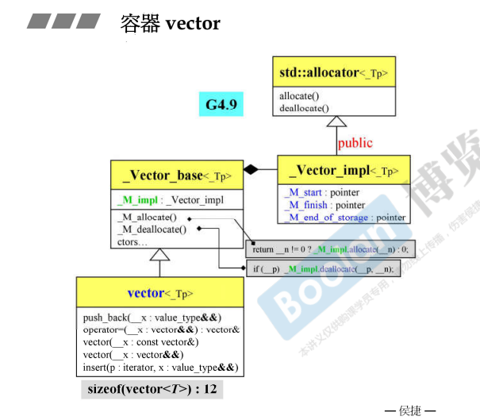

> 大小通过看Classes，仍然只是三个指针，12。

> 这里用public继承，没有道理，这里只是为了让impl用到allocator的方法。

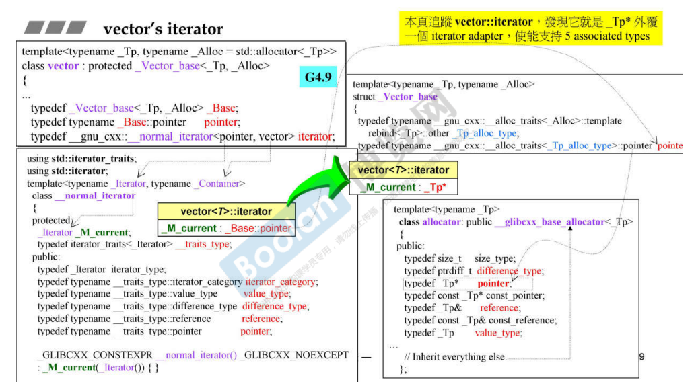

这里的iterator类型，定义为一个类，有_Base::pointer类型成员，追踪发现还是T*。

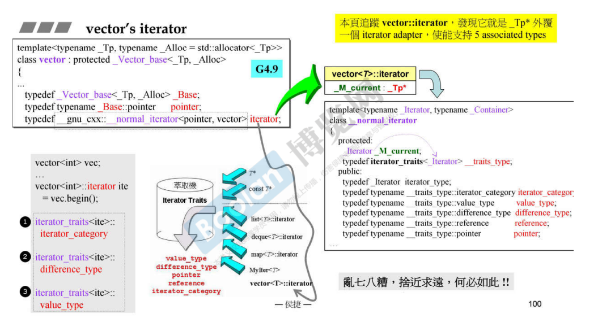
