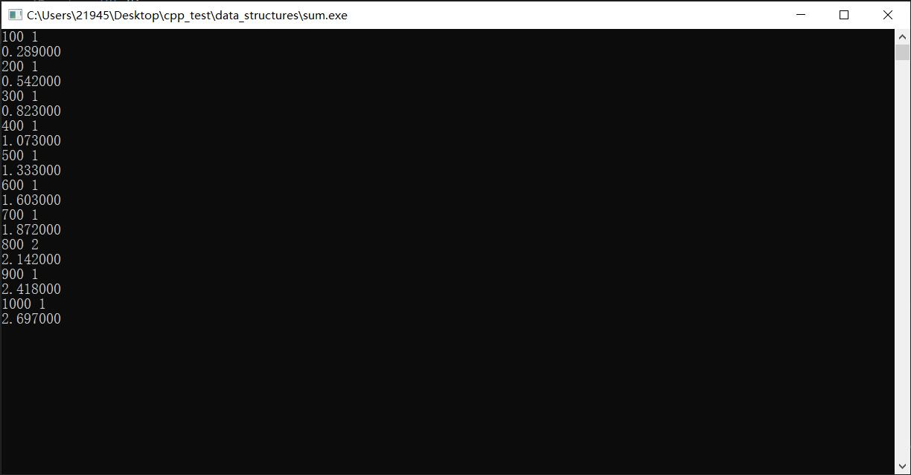
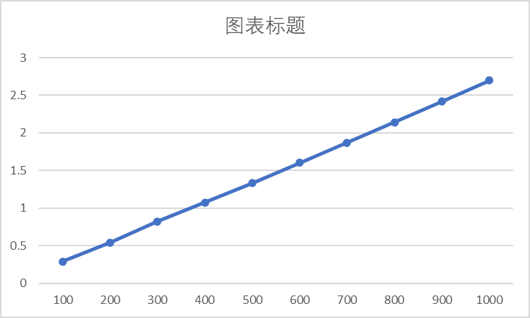
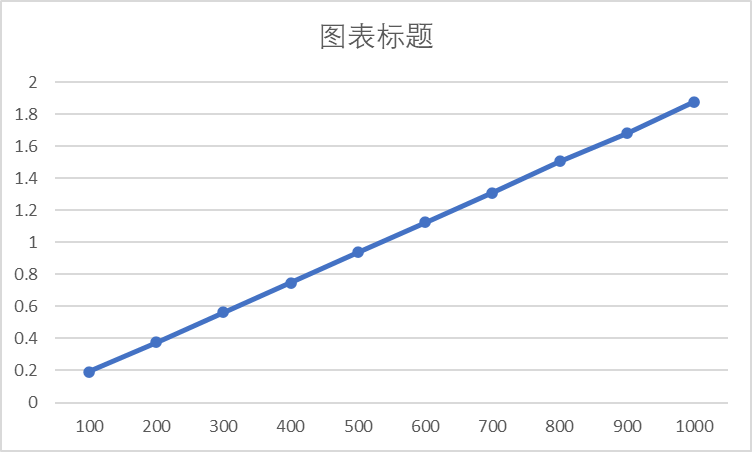
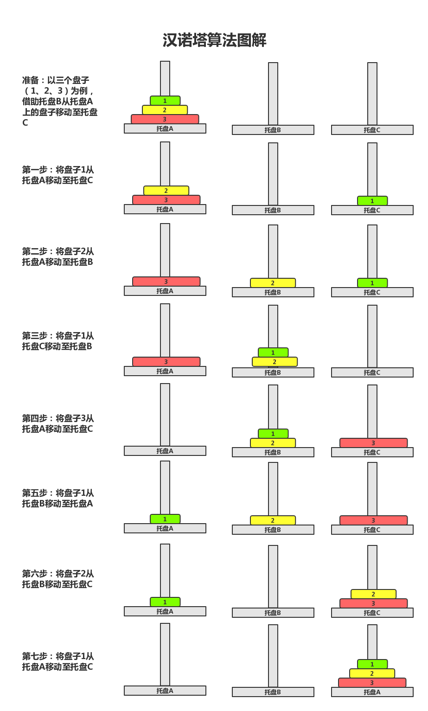
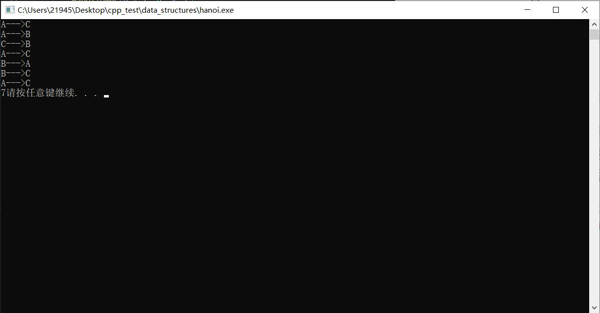
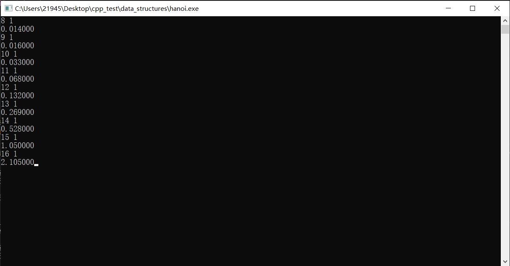
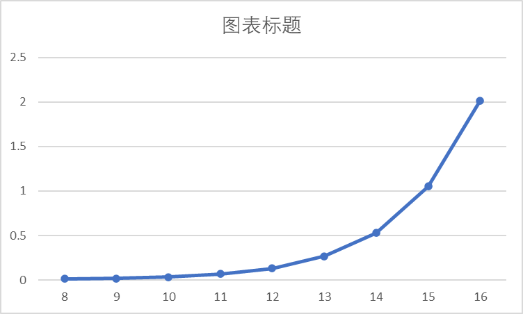
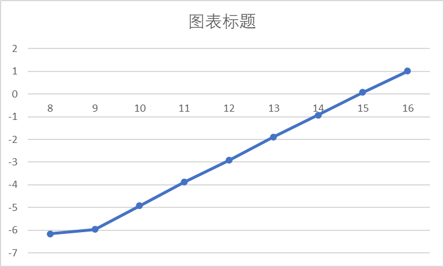

# 求整数和

利用递归来计算n项和的值；测试数据，100~1000，相隔100；clock_t得到时间。

```c
#include <stdio.h>
#include <stdlib.h>
#include <time.h>

int func(int t) {
    // N-1->N
    // 从1开始
    int res = 1;
    if (t > 1) {
        res = t + func(t - 1);
    }
    return res;
}

int main() {
    int n;
    int sign = 1;  
    while (sign != 0) {
        scanf("%d %d", &n, &sign);
        clock_t start, end;
        start = clock();
        for (int i = 0; i < 1000000; i++) {
            // 不要输出，影响时间复杂度
            func(n);
        }
        end = clock();
        double duration = (double)(end - start) / CLOCKS_PER_SEC;
        printf("%f", duration);
    }
    system("pause");
    return 0;
}
```

O(T) = R * O(s)；调用次数为N，递归函数单词时间复杂度为O(1)；O(N)和最后结果相符。





# Pizza

迭代的方式来计算切n刀后的最多的pizza块数；测试数据，100~1000，相隔100；clock_t得到时间。

```c
int main() {
    int n;
    int sign = 1;
    while (sign != 0) {
        scanf("%d %d", &n, &sign);
        clock_t start, end;
        start = clock();
        for (int i = 0; i < 1000000; i++) {
            // 不要输出，影响时间复杂度
            // 1+1+2+3+...+n
            int t = 1;
            for (int i = 1; i <= n; i++) {
                t += i;
            }
        }
        end = clock();
        double duration = (double)(end - start) / CLOCKS_PER_SEC;
        printf("%f", duration);
    }
    system("pause");
    return 0;
}
```

迭代直接看函数体，毫无疑问O(N)。




# Hanoi

借助一个中转柱，使起始柱中按照规则排放的盘子移动到终点柱，且一次只能移动一个盘，且不允许大盘放在小盘上面。



n层问题总可以转换为，n-1层盘子借助中转盘（不一定是B）移动至相邻空盘上，将第n个盘子移动至目标盘，进行n-1层问题。经典递归思想。

函数定义，HanoiTower(int n, char source, char temp, char target)；测试数据为大小为8至16的n；要求对结果做log2，绘制图表。

验证算法正确性。

```c
int count = 0;

void move(char a, char b) {
    printf("%c--->%c\n", a, b);
    count++;
}
/*
 * @a source
 * @b temp
 * @c target
 */
int HanoiTower(int n, char a, char b, char c) {
    if (1 == n) {
        move(a, c);
    } else {
        HanoiTower(n - 1, a, c, b);
        move(a, c);
        HanoiTower(n - 1, b, a, c);
    }
}

int main() {
    int n;
    int sign = 1;

    char a = 'A';
    char b = 'B';
    char c = 'C';

    HanoiTower(3, a, b, c);
    printf("%d", count);
    system("pause");
}
```



```c
int count = 0;

void move(char a, char b) {
    // printf("%c--->%c\n", a, b);
    count++;
}
/*
 * @a source
 * @b temp
 * @c target
 */
void HanoiTower(int n, char a, char b, char c) {
    if (1 == n) {
        move(a, c);
    } else {
        HanoiTower(n - 1, a, c, b);
        move(a, c);
        HanoiTower(n - 1, b, a, c);
    }
}

int main() {
    int n;
    int sign = 1;
    while (sign != 0) {
        scanf("%d %d", &n, &sign);
        count = 0;
        clock_t start, end;
        start = clock();
        for (int i = 0; i < 10000; i++) {
            HanoiTower(n, 'A', 'B', 'C');
        }
        end = clock();
        double duration = (double)(end - start) / CLOCKS_PER_SEC;
        printf("%f", duration);
    }
    system("pause");
    return 0;
}
```





log2后结果。

| 8        | 9        | 10       | 11       | 12       | 13       | 14       | 15       | 16      |
| -------- | -------- | -------- | -------- | -------- | -------- | -------- | -------- | ------- |
| -6.15843 | -5.96578 | -4.92139 | -3.87832 | -2.92139 | -1.89432 | -0.92139 | 0.070389 | 1.01078 |



时间复杂度，从数学上，$T(n)=2 T(n-1)+1$，则可知：

$\begin{aligned} T(1) & =2 T(0)+1=2^0+2^0-1 \\ T(2) & =2 T(1)+1=2^1+2^1-1 \\ T(3) & =2 T(2)+1=2^2+2^2-1 \\ \quad \ldots & \\ T(n) & =2 T(n-1)+1=2^{n-1}+2^{n-1}-1=2^n-1\end{aligned}$

因此，$T(n)=2^n-1=O\left(2^n\right)$；和实验结果相符；从程序上看，每次n层都需要2次n-1操作，必然指数级增长。
