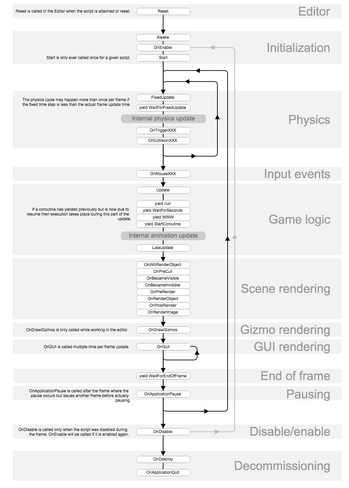
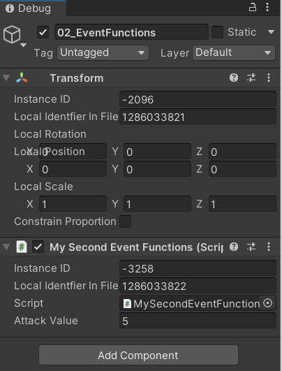
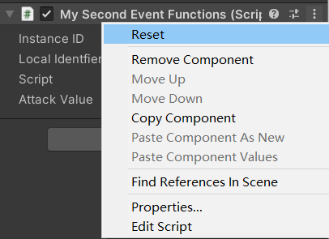
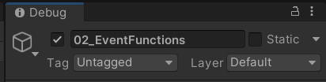
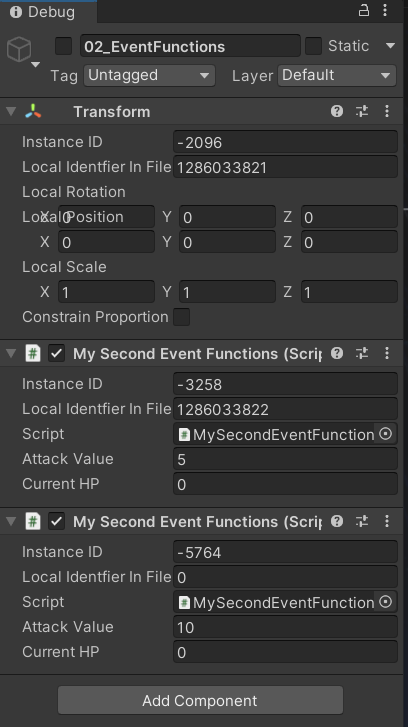

> Print Func
>
> 两个功能，test & debug。
>
> ```c#
> // 1.test
> print("API Study begin1!");
> Debug.Log("API study begin2!");
> // 2.debug
> Debug.Log("1+1 begin");
> int a = 1;
> Debug.Log("a is assigned a value of 1");
> int b = 1;
> Debug.Log("b is assigned a value of 1");
> int num = a + b;
> // Find the mistake by logging
> Debug.Log("2+3=" + num);
> ```
>
> print和Debug.Log都可以，前者是MonoBehaviour的成员，也因此使用时必须继承MonoBehaviour类，建议用后者。
>
> ```c#
> public class TestDebugAndPrintClass : MonoBehaviour
> {
>     public void TestPrint()
>     {
>         print("use print()");
>     }
> 
>     public void TestDebug()
>     {
>         Debug.Log("use debug()");
>     }
> }
> ```
>
> Debug类中还有LogWarning、LogError，人为输出警告和错误。

# Life cycle



# Reset

```c#
public float attackValue = 10;
// 不运行情况，进行调用
private void Reset()
{
    // 1.调用情况
    // 此函数只能在编辑器模式下（不运行）调用。
    // 2.调用时间次数与作用
    // 当脚本第一次挂载到对象或者使用了Reset命令之后调用，
    // 来初始化脚本的各个属性，Reset最常用于在检视面板中提供良好的默认值。
    Debug.Log("use Reset()");
    Debug.Log("attackValue back to default value");
}
```

修改初始值



Reset后，attackValue回到初始值。



# Awake

三种调用情况。

```c#
private void Awake()
{
    // 1.调用情况
    // a.在加载场景时初始化包含脚本的激活状态的GameObject时
    // b.GameObject从非激活转变为激活状态
    // c.在初始化使用Instantiate创建的GameObject之后
    // 2.调用时间次数与作用
    // 在脚本实例的生存期内，Unity仅调用Awake一次。脚本的生存期持续到包含它的场景被卸载为止。
    // Unity调用每个GameObject的Awake的顺序是不确定的，没有先后之分，但是可以人为干涉（即设计）来保证程序的正确性和稳定性。
    // 继承自MonoBehaviour，Awake来代替构造函数进行初始化，在Unity里，组件的初始化不使用构造函数。 
    Debug.Log("use Awake()");
    attackValue = 1;
}
```

激活状态就是上面的勾勾。



# OnEnable

```c#
private void OnEnable()
{
    // 1.调用情况
    // a.游戏物体被激活
    // b.脚本组件被激活
    // 当脚本挂载在物体上，其实ab是一条
    // 2.调用时间次数与作用
    // 每次游戏物体或者脚本被激活都会调用一次
    // 而Awake仅仅只一次
    // 主要用来重复赋值，使变为初始状态
    // Debug.Log("use OnEnable()");
    currentHP = 100;
    Debug.Log("currentHP = " + currentHP);
    attackValue = 2;
}
```

对象池，每次使用怪物时，生成都需要初始状态。这时就放在OnEnable中。

# Start

```c#
void Start()
{
    // 1.调用情况
    // a.游戏物体被激活
    // b.脚本组件被激活
    // 仅仅只会调用一次
    // 2.调用时间次数与作用
    // 在脚本实例激活时在第一帧的Update之前被调用
    // 后于Awake执行，方便控制逻辑的前后调用顺序
    // 例如资源加载后再实例化按钮或者物体
    Debug.Log("use Start()");
    attackValue = 3;
}
```

变量赋值顺序

文件头声明后直接赋值；显示面板赋值；外部赋值。外部赋值如下。

```c#
public MySecondEventFunction api;
// Start is called before the first frame update
void Start()
{
 //通过外部获取组件引用对变量进行赋值
 api.attackValue = -1;
}
```

同时外部拖拽赋值即可。



则赋值顺序经过实验，得到，**声明直接赋值 -> 检视面板赋值 -> Awake -> OnEnable -> Start -> 外部赋值**。

对一个对象赋值，或者准确说从外部对一个对象的属性或者成员变量赋值的前提是，该对象已经有了，所以外部赋值常常是最后的。

例外情况就是两个脚本挂载在同一Object下，则Start的顺序不可知，在Start中进行的外部赋值自然不可知。

# Update

```c#
void Update()
{
    // 1.调用情况
    // a.游戏物体被激活
    // b.脚本组件被激活
    // 2.调用时间次数与作用
    // 每帧调用，是最常用函数,每秒调用60次左右(根据当前电脑的的性能和状态)
    // 实时更新数据，例如实时接受输入数据
    Debug.Log("use Update()");
}
```

```c#
private void LateUpdate()
{
    // 1.调用情况
    // a.游戏物体被激活
    // b.脚本组件被激活
    // 2.调用时间,次数与作用
    // LateUpdate在调用所有Update函数后调用,每秒调用60次左右,安排脚本的执行顺序
    // 容易知道LateUpdate用于安排后于Update的行为，一些延时性逻辑
    // 比如摄像机跟随，一定是人物先移动了，摄像机才会跟随
    Debug.Log("use LateUpdate()");
}
```

# OnDisable

```c#
private void OnDisable()
{
    // 1.调用情况
    // a.游戏物体被禁用
    // b.脚本组件被禁用
    // c.游戏物体被销毁
    // 2.调用时间,次数与作用
    // 满足调用情况时即时调用一次，用于一些对象的状态重置、资源回收与清理
    // 根据开发习惯使用OnEnable和OnDisable
    // 一般来说OnEnable做出厂设置，OnDisable做回厂重置
    Debug.Log("use OnDisable()");
}
```

```c#
void OnApplicatoinQuit()
{
    // 1.调用情况
    // a.在程序退出之前所有的游戏对象都会调用这个函数
    // b.在编辑器中会在用户终止播放模式时调用
    // c.在网页视图关闭时调用
    // 2.调用时间,次数与作用
    // 满足调用情况时即时调用一次，用于处理一些游戏退出后的逻辑
    Debug.Log("OnApplicationQuit()");
}


void OnDestroy()
{
    // 1.调用情况
    // a.场景或游戏结束
    // b.停止播放模式将终止应用程序
    // c.在网页视图关闭时调用
    // d.当前脚本被移除
    // e.当前脚本挂载到的游戏物体被删除
    // 2.调用时间,次数与作用
    // 满足调用情况时即时调用一次，用于一些游戏物体的销毁
    Debug.Log("OnDestroy()");
}
```
