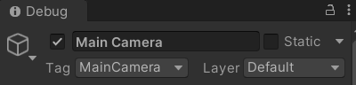
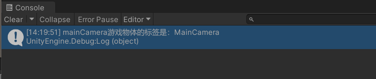
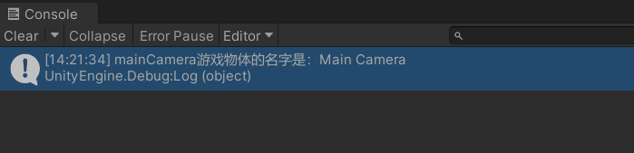
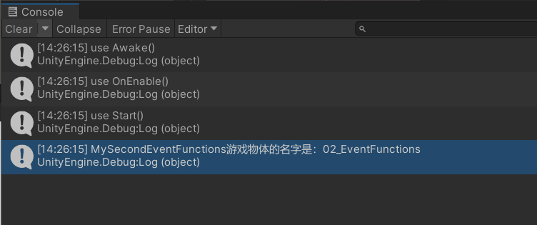
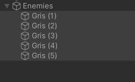
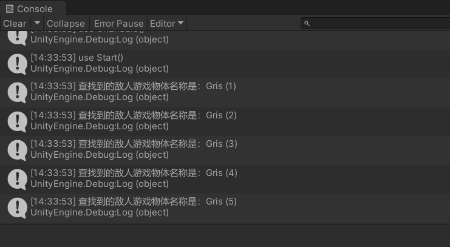

# 创建游戏物体

```c#
// 1.创建方式
// a.使用构造函数（声明+实例化） 创建一个空的游戏对象
GameObject myGo = new GameObject("MyGameObject");
// b.根据现有的预制体（游戏物体）资源或者游戏场景已有的游戏物体来实例化
// GameObject可以省略，也常常省略
GameObject.Instantiate(grisGo);
// c.使用特别的API创建一些基本的游戏物体类型（原始几何体）
GameObject.CreatePrimitive(PrimitiveType.Plane);
```

# 游戏物体的查找和获取

通过组件。

```c#
// 2.游戏物体的查找和获取
this; // 当前组件MyThirdGameObject
this.grisGo;
Test();
this.Test(); // this指向当前组件，使用当前组件内方法
this.gameObject; // 当前挂载到的游戏物体
Debug.Log("当前脚本挂载到的游戏物体名称是：" + gameObject.name);
```

# 游戏物体的方法和其他成员变量

对当前游戏物体。

```c#
// 静态方法
GameObject.Instantiate;
GameObject.CreatePrimitive;
// 标签变量
// 标签，即对游戏物体分组
Debug.Log("当前游戏物体标签是：" + gameObject.tag);
// 注意层级是int变量
// 主要用于物理、渲染
Debug.Log("当前游戏物体层级是：" + gameObject.layer);
// 游戏物体的激活失活
gameObject.SetActive(true);
// 成员变量看激活失活状态
Debug.Log("当前游戏物体的状态是：" + gameObject.activeInHierarchy);
Debug.Log("当前游戏物体的状态是：" + gameObject.activeSelf);
```

> 可以通过其他物体的组件或者特殊API，访问到其他游戏物体。

# 其他游戏物体的查找

有引用，直接使用引用。

```c#
// 有引用
// 对自己 this.gameObject
// 对其他游戏物体 
Debug.Log("gris游戏物体的状态是：" + grisGo.activeSelf);
```

没有直接引用，通过名称、标签、类型查找。



```c#
// 没有直接引用
// 对其他游戏物体查找（这时游戏物体必须是激活状态）
// a.通过名称查找
GameObject mainCameraGo = GameObject.Find("Main Camera");
Debug.Log("mainCamera游戏物体的标签是：" + mainCameraGo.tag);
```



```c#
// b.通过标签查找
GameObject mainCameraGo = GameObject.FindGameObjectWithTag("MainCamera");
Debug.Log("mainCamera游戏物体的名字是：" + mainCameraGo.name);
```



```c#
// c.通过类型（这里就是类名）查找
// 游戏物体隐藏起来，就会找不到，必须是激活状态
MySecondEventFunctions mySecondEventFunctions = GameObject.FindObjectOfType<MySecondEventFunctions>();
Debug.Log("MySecondEventFunctions游戏物体的名字是：" + mySecondEventFunctions.name);
```



**查找游戏物体对象。**



```c#
// d.多数查找与获取
// FindGameObjects
GameObject[] enemyGos = GameObject.FindGameObjectsWithTag("Enemy");
for (int i = 0; i < enemyGos.Length; i++)
{
    Debug.Log("查找到的敌人游戏物体名称是：" + enemyGos[i].name);
}
```



**查找对象**，没有withTags，可以通过类型ofTypes查找。

```c#
// FindObjects
// 在所有Enemy上添加BoxCollider组件
BoxCollider[] colliders = GameObject.FindObjectsOfType<BoxCollider>();
for (int i = 0; i < colliders.Length; i++)
{
    // 碰撞器名称也是挂载到的游戏物体名称
    Debug.Log("查找到的敌人碰撞器名称是：" + colliders[i].name);
}
```

